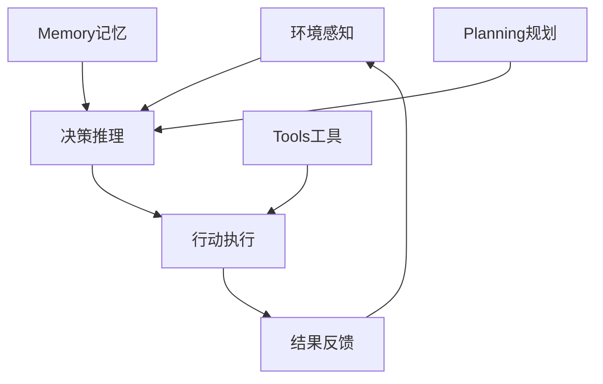

# 🤖 AI Agent 完整学习指南

> 从零基础到专家级的AI Agent开发学习路径，包含6个阶段和6个实战项目

## 📋 学习路径总览

### 🎯 六阶段学习体系

| 阶段 | 时间 | 核心内容 | 重点技能 | 实战项目 |
|------|------|----------|----------|----------|
| **基础阶段** | 2-3周 | AI Agent概念、Function Calling | 工具集成、Prompt设计 | [简单问答Agent](./projects/01-simple-qa-agent.md) |
| **技术栈** | 3-4周 | LangChain、RAG、向量数据库 | 文档处理、检索增强 | [RAG知识助手](./projects/02-rag-knowledge-assistant.md) |
| **高级模式** | 4-5周 | 复杂Agent架构、工作流编排 | LangGraph、多步推理 | [智能客服系统](./projects/03-intelligent-customer-service.md) |
| **多Agent** | 3-4周 | Agent协作、角色分工 | CrewAI、团队编排 | [内容创作团队](./projects/04-content-creation-team.md) |
| **企业级** | 4-5周 | 性能优化、监控部署 | 微服务、容器化 | [企业Agent平台](./projects/05-enterprise-agent-platform.md) |
| **实战应用** | 3-4周 | 垂直领域解决方案 | 行业定制、生产部署 | [行业解决方案](./projects/06-industry-solutions.md) |

**总学习时间：18-22周 | 适合人群：有Python基础的开发者**

---

## 🎓 第一阶段：基础概念与理论（2-3周）

### 学习目标
- 理解AI Agent的核心概念和架构
- 掌握OpenAI Function Calling机制
- 学会设计有效的系统提示
- 能够集成基础工具和API

### 核心概念

#### 1.1 AI Agent基础理论


**关键概念**：
- **感知（Perception）**：理解用户输入和环境状态
- **推理（Reasoning）**：基于信息进行逻辑思考
- **行动（Action）**：执行具体的工具调用
- **记忆（Memory）**：维护对话和任务上下文

#### 1.2 ReAct模式详解
```python
# ReAct = Reasoning + Acting
def react_agent_loop(query):
    while not task_completed:
        # Reasoning: 分析当前状态，决定下一步
        thought = llm.generate(f"思考: 为了回答'{query}', 我需要...")

        # Acting: 执行具体行动
        if need_tool:
            action = llm.choose_tool(available_tools)
            result = execute_tool(action)

        # 基于结果继续推理
        if is_sufficient(result):
            return generate_final_answer()
        else:
            continue_reasoning(result)
```

#### 1.3 Function Calling技术深度
```python
# OpenAI Function Calling 最佳实践
tools = [
    {
        "type": "function",
        "function": {
            "name": "get_weather",
            "description": "获取指定城市的详细天气信息",
            "parameters": {
                "type": "object",
                "properties": {
                    "city": {
                        "type": "string",
                        "description": "城市名称，支持中英文"
                    },
                    "unit": {
                        "type": "string",
                        "enum": ["celsius", "fahrenheit"],
                        "default": "celsius"
                    }
                },
                "required": ["city"]
            }
        }
    }
]

# 关键设计原则
# 1. 描述要精确明确
# 2. 参数类型要严格定义
# 3. 枚举值要完整
# 4. 必需参数要明确标注
```

### 实战项目：[简单问答Agent](./projects/01-simple-qa-agent.md)
**技术栈**：OpenAI API + Python + Streamlit
**核心功能**：多工具集成、对话记忆、Web界面
**学习重点**：Function Calling、工具设计、错误处理

---

## 🔧 第二阶段：核心技术栈（3-4周）

### 学习目标
- 深入掌握LangChain生态系统
- 理解RAG技术原理和实现
- 熟练使用向量数据库
- 掌握文档处理和知识管理

### 核心技术

#### 2.1 LangChain架构深入
```python
# LangChain核心组件体系
from langchain_core.prompts import ChatPromptTemplate
from langchain_core.output_parsers import StrOutputParser
from langchain_core.runnables import RunnablePassthrough
from langchain_openai import ChatOpenAI

# LCEL (LangChain Expression Language)
chain = (
    {"context": retriever, "question": RunnablePassthrough()}
    | prompt
    | llm
    | StrOutputParser()
)

# 核心设计原则
# 1. 组件化：每个功能独立封装
# 2. 可组合：通过管道符连接
# 3. 异步支持：支持并发执行
# 4. 可观测：内置调试和监控
```

#### 2.2 RAG技术深度解析
```python
# RAG 完整流程实现
class RAGSystem:
    def __init__(self):
        self.embeddings = OpenAIEmbeddings()
        self.vectorstore = Chroma()
        self.llm = ChatOpenAI()

    def ingest_documents(self, docs):
        # 1. 文档分割
        splitter = RecursiveCharacterTextSplitter(
            chunk_size=1000,
            chunk_overlap=200
        )
        splits = splitter.split_documents(docs)

        # 2. 向量化存储
        self.vectorstore.add_documents(splits)

    def query(self, question):
        # 3. 检索相关文档
        relevant_docs = self.vectorstore.similarity_search(question, k=4)

        # 4. 构建增强提示
        context = "\n".join([doc.page_content for doc in relevant_docs])

        # 5. 生成回答
        prompt = f"基于以下信息回答问题:\n{context}\n\n问题: {question}"
        return self.llm.invoke(prompt)
```

#### 2.3 向量数据库选择指南
| 数据库 | 适用场景 | 优势 | 劣势 |
|--------|----------|------|------|
| **Chroma** | 原型开发、小规模 | 轻量、易用 | 性能有限 |
| **Pinecone** | 生产环境、大规模 | 高性能、托管 | 成本较高 |
| **Weaviate** | 企业级、复杂查询 | 功能丰富、开源 | 学习成本高 |
| **Qdrant** | 高性能要求 | 速度快、Rust编写 | 生态相对小 |

### 实战项目：[RAG知识助手](./projects/02-rag-knowledge-assistant.md)
**技术栈**：LangChain + Chroma + FastAPI + Streamlit
**核心功能**：文档处理、向量检索、智能问答、企业级架构
**学习重点**：RAG优化、检索策略、系统架构

---

## 🚀 第三阶段：高级Agent模式（4-5周）

### 学习目标
- 掌握复杂Agent架构设计
- 学会使用LangGraph编排工作流
- 理解Agent的记忆和规划机制
- 构建多步骤推理系统

### 高级架构

#### 3.1 多Agent系统设计
```python
# 智能客服系统架构
class CustomerServiceSystem:
    def __init__(self):
        self.intent_agent = IntentClassificationAgent()
        self.knowledge_agent = KnowledgeRetrievalAgent()
        self.task_agent = TaskExecutionAgent()
        self.quality_agent = QualityAssuranceAgent()

    async def handle_customer_query(self, query):
        # 1. 意图识别
        intent = await self.intent_agent.classify(query)

        # 2. 知识检索
        knowledge = await self.knowledge_agent.search(query)

        # 3. 任务执行
        action_plan = await self.task_agent.plan(intent, knowledge)
        result = await self.task_agent.execute(action_plan)

        # 4. 质量检查
        final_response = await self.quality_agent.review(result)

        return final_response
```

#### 3.2 LangGraph工作流编排
```python
from langgraph.graph import StateGraph, END

# 定义状态
class CustomerServiceState(TypedDict):
    query: str
    intent: str
    knowledge: List[str]
    response: str
    quality_score: float

# 构建工作流图
workflow = StateGraph(CustomerServiceState)

workflow.add_node("classify_intent", classify_intent_node)
workflow.add_node("retrieve_knowledge", retrieve_knowledge_node)
workflow.add_node("generate_response", generate_response_node)
workflow.add_node("quality_check", quality_check_node)

# 设置流程
workflow.set_entry_point("classify_intent")
workflow.add_edge("classify_intent", "retrieve_knowledge")
workflow.add_edge("retrieve_knowledge", "generate_response")
workflow.add_conditional_edges(
    "generate_response",
    lambda x: "quality_check" if x["quality_score"] < 0.8 else END
)

app = workflow.compile()
```

### 实战项目：[智能客服系统](./projects/03-intelligent-customer-service.md)
**技术栈**：LangGraph + FastAPI + Redis + PostgreSQL
**核心功能**：多Agent协作、工作流编排、智能路由、质量监控
**学习重点**：复杂系统设计、Agent协调、性能优化

---

## 👥 第四阶段：多Agent协作（3-4周）

### 学习目标
- 理解多Agent协作模式
- 掌握CrewAI等协作框架
- 学会角色分工和任务分配
- 构建高效的团队工作流

### 协作模式

#### 4.1 Agent协作模式
```python
# CrewAI 团队协作示例
from crewai import Agent, Task, Crew

# 定义Agent角色
researcher = Agent(
    role='研究员',
    goal='收集和分析相关信息',
    backstory='你是一个经验丰富的研究专家',
    tools=[search_tool, web_scraper],
    verbose=True
)

writer = Agent(
    role='内容创作者',
    goal='创作高质量的内容',
    backstory='你是一个专业的内容创作专家',
    tools=[writing_tool, grammar_checker],
    verbose=True
)

editor = Agent(
    role='编辑',
    goal='优化和完善内容质量',
    backstory='你是一个严格的内容编辑',
    tools=[editing_tool, fact_checker],
    verbose=True
)

# 定义任务流程
research_task = Task(
    description='研究{topic}的最新发展和趋势',
    agent=researcher,
    expected_output='详细的研究报告'
)

writing_task = Task(
    description='基于研究结果创作文章',
    agent=writer,
    expected_output='完整的文章草稿'
)

editing_task = Task(
    description='编辑和优化文章',
    agent=editor,
    expected_output='最终发布版本'
)

# 组建团队
crew = Crew(
    agents=[researcher, writer, editor],
    tasks=[research_task, writing_task, editing_task],
    verbose=True
)
```

### 实战项目：[内容创作团队](./projects/04-content-creation-team.md)
**技术栈**：CrewAI + LangChain + Google Search API
**核心功能**：角色分工、协作流程、质量控制、自动化内容生产
**学习重点**：团队协作、工作流优化、角色设计

---

## 🏢 第五阶段：企业级优化（4-5周）

### 学习目标
- 掌握Agent系统性能优化
- 学会监控和调试技术
- 理解成本控制策略
- 构建企业级Agent平台

### 企业级特性

#### 5.1 性能优化策略
```python
# 缓存策略
from functools import lru_cache
import redis

class AgentCache:
    def __init__(self):
        self.redis_client = redis.Redis()

    @lru_cache(maxsize=1000)
    def get_embedding(self, text):
        # 嵌入向量缓存
        cache_key = f"embedding:{hash(text)}"
        cached = self.redis_client.get(cache_key)
        if cached:
            return json.loads(cached)

        embedding = openai.embeddings.create(
            input=text,
            model="text-embedding-3-large"
        )

        self.redis_client.setex(
            cache_key,
            3600,  # 1小时过期
            json.dumps(embedding.data[0].embedding)
        )
        return embedding.data[0].embedding

# 并发处理
import asyncio
from concurrent.futures import ThreadPoolExecutor

class ParallelAgent:
    def __init__(self):
        self.executor = ThreadPoolExecutor(max_workers=10)

    async def process_batch(self, queries):
        tasks = [
            self.process_single_query(query)
            for query in queries
        ]
        return await asyncio.gather(*tasks)
```

#### 5.2 监控和可观测性
```python
# LangSmith集成
from langsmith import Client
import logging

class AgentMonitor:
    def __init__(self):
        self.langsmith = Client()
        self.logger = logging.getLogger(__name__)

    def trace_agent_execution(self, agent_name, input_data):
        with self.langsmith.trace(
            name=f"{agent_name}_execution",
            inputs=input_data
        ) as run:
            try:
                result = self.execute_agent(input_data)
                run.end(outputs={"result": result})
                return result
            except Exception as e:
                run.end(error=str(e))
                self.logger.error(f"Agent {agent_name} failed: {e}")
                raise

# Prometheus指标
from prometheus_client import Counter, Histogram, start_http_server

REQUEST_COUNT = Counter('agent_requests_total', 'Total agent requests')
REQUEST_DURATION = Histogram('agent_request_duration_seconds', 'Request duration')

class MetricsCollector:
    @staticmethod
    def record_request():
        REQUEST_COUNT.inc()

    @staticmethod
    def record_duration(duration):
        REQUEST_DURATION.observe(duration)
```

### 实战项目：[企业级Agent平台](./projects/05-enterprise-agent-platform.md)
**技术栈**：微服务 + Kubernetes + Prometheus + Redis
**核心功能**：服务编排、监控告警、自动扩缩容、多租户支持
**学习重点**：系统架构、DevOps、生产运维

---

## 🌍 第六阶段：行业应用实战（3-4周）

### 学习目标
- 掌握垂直领域Agent开发
- 学会行业定制和优化
- 理解合规和安全要求
- 构建完整的商业解决方案

### 行业应用

#### 6.1 垂直领域定制
```python
# 金融风险评估Agent
class FinancialRiskAgent:
    def __init__(self):
        self.risk_models = self.load_risk_models()
        self.compliance_checker = ComplianceChecker()

    def assess_loan_risk(self, application):
        # 1. 数据收集
        credit_data = self.get_credit_history(application.user_id)
        market_data = self.get_market_conditions()

        # 2. 风险计算
        risk_score = self.calculate_risk_score(
            application, credit_data, market_data
        )

        # 3. 合规检查
        compliance_result = self.compliance_checker.verify(
            application, risk_score
        )

        # 4. 生成报告
        return self.generate_risk_report(
            risk_score, compliance_result
        )

# 医疗诊断辅助Agent
class MedicalDiagnosisAgent:
    def __init__(self):
        self.medical_kb = MedicalKnowledgeBase()
        self.symptom_analyzer = SymptomAnalyzer()

    def analyze_symptoms(self, patient_data):
        # 1. 症状分析
        symptoms = self.extract_symptoms(patient_data)

        # 2. 知识库检索
        relevant_conditions = self.medical_kb.search(symptoms)

        # 3. 诊断建议
        diagnosis_suggestions = self.generate_suggestions(
            symptoms, relevant_conditions
        )

        # 4. 安全提醒
        return self.add_medical_disclaimers(diagnosis_suggestions)
```

### 实战项目：[行业解决方案](./projects/06-industry-solutions.md)
**技术栈**：全栈技术 + 行业特定API + 安全合规
**核心功能**：垂直定制、合规处理、用户界面、商业部署
**学习重点**：行业理解、合规设计、商业化

---

## 📚 学习资源和工具

### 🔧 开发工具推荐
- **开发环境**：VS Code + Python 3.11 + Docker
- **API管理**：OpenAI API + Anthropic Claude + 本地模型
- **向量数据库**：Chroma (开发) + Pinecone (生产)
- **监控工具**：LangSmith + Prometheus + Grafana

### 📖 核心学习资料
- **官方文档**：[LangChain](https://docs.langchain.com/) | [OpenAI](https://platform.openai.com/docs)
- **在线课程**：DeepLearning.AI Agent系列课程
- **开源项目**：LangChain、AutoGen、CrewAI
- **技术社区**：LangChain Discord、GitHub Discussions

### 💰 成本管理
```python
# API成本预估和控制
class CostManager:
    def __init__(self):
        self.usage_tracker = UsageTracker()
        self.budget_limits = {
            "daily": 100,    # $100/day
            "monthly": 2000  # $2000/month
        }

    def estimate_cost(self, model, input_tokens, output_tokens):
        pricing = {
            "gpt-4": {"input": 0.03, "output": 0.06},
            "gpt-3.5-turbo": {"input": 0.002, "output": 0.002}
        }

        cost = (
            (input_tokens / 1000) * pricing[model]["input"] +
            (output_tokens / 1000) * pricing[model]["output"]
        )
        return cost

    def check_budget(self, estimated_cost):
        current_usage = self.usage_tracker.get_daily_usage()
        if current_usage + estimated_cost > self.budget_limits["daily"]:
            raise BudgetExceededException("Daily budget exceeded")
```

---

## 🎯 学习建议

### 学习策略
1. **理论与实践并重**：每个概念都要动手实现
2. **项目驱动学习**：以解决实际问题为导向
3. **循序渐进**：不跳跃，扎实掌握每个阶段
4. **社区参与**：加入技术社区，分享交流

### 常见误区
- ❌ 只学理论不实践
- ❌ 跳跃式学习，基础不扎实
- ❌ 忽视性能和成本优化
- ❌ 不关注行业应用和商业价值

### 成功标准
完成学习后，你将能够：
- ✅ 独立设计和开发AI Agent系统
- ✅ 处理复杂的多Agent协作场景
- ✅ 部署企业级Agent应用
- ✅ 解决特定行业的实际问题

---

## 🚀 立即开始

**下一步行动**：
1. 📖 阅读本指南，理解整体框架
2. ⚙️ 配置开发环境（Python + OpenAI API）
3. 🛠️ 开始第一个项目：[简单问答Agent](./projects/01-simple-qa-agent.md)
4. 🤝 加入学习社区，寻找学习伙伴

**预计收获**：
- 🎯 系统性的AI Agent开发能力
- 🏗️ 企业级系统设计经验
- 💼 行业应用解决方案能力
- 🌟 在AI Agent领域的竞争优势

---

*最后更新：2024年10月 | 学习周期：18-22周 | 适合人群：Python开发者*