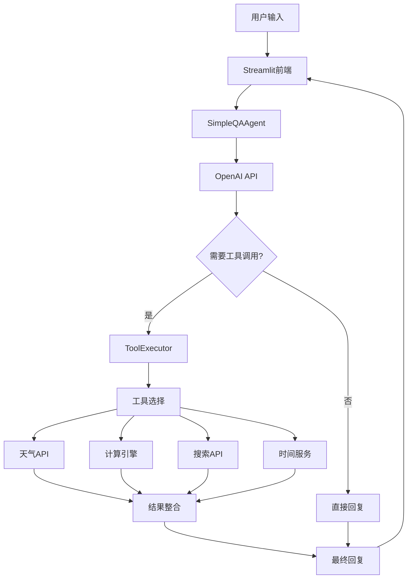

# 项目1：简单问答Agent

> **项目背景**：构建一个能够使用多种工具的智能问答助手，掌握AI Agent开发的基础概念和核心技能。

## 🎯 项目概述

### 项目背景
在当今AI快速发展的时代，传统的ChatBot只能进行简单对话，而AI Agent则具备了使用工具、执行任务的能力。本项目将从零开始构建一个功能完整的问答Agent，让你深入理解Agent的工作原理。

### 核心价值
- **技能建立**：掌握Function Calling、工具集成等核心技能
- **架构理解**：理解Agent的感知-推理-行动循环
- **实践导向**：通过实际编码加深对理论概念的理解
- **基础奠定**：为后续复杂项目打下坚实基础

### 目标用户
- 希望入门AI Agent开发的Python开发者
- 想要理解LLM工具调用机制的技术人员
- 对智能对话系统感兴趣的学习者

## 📋 项目规格

### 功能需求
| 功能模块 | 核心能力 | 优先级 | 实现复杂度 |
|----------|----------|--------|------------|
| **自然对话** | 多轮对话、上下文理解 | P0 | ⭐⭐ |
| **天气查询** | 全球城市天气、多单位支持 | P0 | ⭐⭐⭐ |
| **数学计算** | 复杂表达式、函数运算 | P0 | ⭐⭐⭐ |
| **网络搜索** | 实时信息检索、结果整理 | P1 | ⭐⭐⭐⭐ |
| **时间查询** | 多时区时间、格式化显示 | P1 | ⭐⭐ |
| **对话记忆** | 历史维护、上下文管理 | P0 | ⭐⭐ |
| **Web界面** | 友好交互、实时反馈 | P1 | ⭐⭐⭐ |

### 非功能需求
- **性能**：单次查询响应时间 < 5秒
- **可靠性**：工具调用成功率 > 95%
- **可用性**：界面友好，错误提示清晰
- **可扩展性**：支持新工具的快速集成

## 🛠️ 技术架构

### 技术栈选择

#### 核心技术栈
```python
# 核心依赖
openai>=1.3.5          # OpenAI API，支持Function Calling
requests>=2.31.0       # HTTP请求，用于API调用
streamlit>=1.28.0      # Web界面框架
python-dotenv>=1.0.0   # 环境变量管理

# 扩展依赖
pytz>=2023.3          # 时区处理
pytest>=7.4.0         # 单元测试
black>=23.0.0         # 代码格式化
```

#### 选择理由
| 技术 | 选择理由 | 替代方案 |
|------|----------|----------|
| **OpenAI API** | Function Calling支持完善，文档详细 | Anthropic Claude、本地模型 |
| **Streamlit** | 快速原型开发，学习成本低 | Flask+React、Gradio |
| **Python** | AI生态丰富，易于理解和调试 | JavaScript、Go |

### 系统架构设计



### 核心组件设计

#### 1. Agent核心类
```python
class SimpleQAAgent:
    """
    简单问答Agent主类
    负责：对话管理、工具调用、结果整合
    """
    def __init__(self):
        self.config = Config()
        self.client = openai.OpenAI()
        self.tool_executor = ToolExecutor()
        self.conversation_history = []
        self.tools = self._define_tools()

    def chat(self, message: str) -> Dict[str, Any]:
        """主要对话接口"""
        pass

    def _execute_tool(self, tool_name: str, **kwargs) -> str:
        """工具执行逻辑"""
        pass
```

#### 2. 工具执行器
```python
class ToolExecutor:
    """
    工具执行器
    负责：具体工具的实现和调用
    """
    def get_weather(self, city: str, units: str = "metric") -> str:
        """天气查询工具"""
        pass

    def calculate(self, expression: str) -> str:
        """数学计算工具"""
        pass

    def web_search(self, query: str, num_results: int = 5) -> str:
        """网络搜索工具"""
        pass
```

## 💻 实现指南

### 环境搭建

#### 1. 项目初始化
```bash
# 创建项目目录
mkdir simple-qa-agent && cd simple-qa-agent

# 创建Python虚拟环境
python -m venv venv

# 激活虚拟环境
# Windows
venv\Scripts\activate
# macOS/Linux
source venv/bin/activate

# 升级pip
pip install --upgrade pip
```

#### 2. 依赖安装
```bash
# 安装核心依赖
pip install openai==1.3.5 requests==2.31.0 streamlit==1.28.0 python-dotenv==1.0.0

# 安装开发依赖
pip install pytest==7.4.0 black==23.0.0 pytz==2023.3

# 生成requirements.txt
pip freeze > requirements.txt
```

#### 3. 项目结构
```
simple-qa-agent/
├── .env                    # 环境变量（不提交到git）
├── .gitignore             # Git忽略文件
├── requirements.txt       # Python依赖
├── README.md             # 项目说明
├── config.py             # 配置管理
├── tools.py              # 工具实现
├── agent.py              # Agent核心类
├── app.py                # Streamlit应用
├── tests/                # 测试文件
│   ├── __init__.py
│   ├── test_agent.py     # Agent测试
│   ├── test_tools.py     # 工具测试
│   └── test_integration.py # 集成测试
└── docs/                 # 文档
    ├── api.md           # API文档
    └── deployment.md    # 部署指南
```

### 核心代码实现

#### 1. 配置管理 (config.py)
```python
import os
from dotenv import load_dotenv
from typing import Optional

# 加载环境变量
load_dotenv()

class Config:
    """配置管理类"""

    # API密钥
    OPENAI_API_KEY: str = os.getenv("OPENAI_API_KEY", "")
    WEATHER_API_KEY: str = os.getenv("WEATHER_API_KEY", "")
    SERPER_API_KEY: str = os.getenv("SERPER_API_KEY", "")  # Google搜索API

    # 模型配置
    MODEL_NAME: str = "gpt-4-1106-preview"
    MAX_TOKENS: int = 2000
    TEMPERATURE: float = 0.1

    # 工具配置
    MAX_SEARCH_RESULTS: int = 5
    WEATHER_UNITS: str = "metric"
    CALCULATION_TIMEOUT: int = 5  # 计算超时时间（秒）

    # 应用配置
    DEBUG: bool = os.getenv("DEBUG", "False").lower() == "true"
    LOG_LEVEL: str = os.getenv("LOG_LEVEL", "INFO")

    @classmethod
    def validate(cls) -> bool:
        """验证配置完整性"""
        required_keys = ["OPENAI_API_KEY"]
        missing_keys = []

        for key in required_keys:
            if not getattr(cls, key):
                missing_keys.append(key)

        if missing_keys:
            raise ValueError(f"Missing required configuration: {missing_keys}")

        return True

# 配置验证
try:
    Config.validate()
except ValueError as e:
    print(f"Configuration Error: {e}")
    print("Please check your .env file and ensure all required keys are set.")
```

#### 2. 工具实现 (tools.py)
```python
import requests
import json
import math
import ast
import operator
import pytz
from datetime import datetime
from typing import Dict, Any, List, Union
from config import Config
import logging

logger = logging.getLogger(__name__)

class ToolExecutor:
    """工具执行器类，负责所有工具的具体实现"""

    def __init__(self):
        self.config = Config()

    def get_weather(self, city: str, units: str = "metric") -> str:
        """
        获取指定城市的天气信息

        Args:
            city: 城市名称，支持中英文
            units: 温度单位，metric(摄氏度) 或 imperial(华氏度)

        Returns:
            格式化的天气信息字符串
        """
        try:
            # OpenWeatherMap API调用
            url = "http://api.openweathermap.org/data/2.5/weather"
            params = {
                "q": city,
                "appid": self.config.WEATHER_API_KEY,
                "units": units,
                "lang": "zh_cn"  # 中文返回
            }

            response = requests.get(url, params=params, timeout=10)
            response.raise_for_status()

            data = response.json()

            # 提取关键信息
            weather_info = {
                "city": data["name"],
                "country": data["sys"]["country"],
                "weather": data["weather"][0]["description"],
                "temperature": data["main"]["temp"],
                "feels_like": data["main"]["feels_like"],
                "humidity": data["main"]["humidity"],
                "pressure": data["main"]["pressure"],
                "wind_speed": data.get("wind", {}).get("speed", "N/A"),
                "visibility": data.get("visibility", "N/A")
            }

            # 温度单位
            unit_symbol = "°C" if units == "metric" else "°F"
            speed_unit = "m/s" if units == "metric" else "mph"

            # 格式化输出
            return f"""🌤️ {weather_info['city']}, {weather_info['country']} 天气信息：

📊 天气状况：{weather_info['weather']}
🌡️ 当前温度：{weather_info['temperature']}{unit_symbol}
🤚 体感温度：{weather_info['feels_like']}{unit_symbol}
💧 湿度：{weather_info['humidity']}%
📈 气压：{weather_info['pressure']} hPa
💨 风速：{weather_info['wind_speed']} {speed_unit}
👁️ 能见度：{weather_info['visibility']/1000 if weather_info['visibility'] != 'N/A' else 'N/A'} km"""

        except requests.exceptions.RequestException as e:
            logger.error(f"Weather API request failed: {e}")
            return f"❌ 获取{city}天气信息失败：网络请求错误"
        except KeyError as e:
            logger.error(f"Weather data parsing failed: {e}")
            return f"❌ 获取{city}天气信息失败：数据解析错误"
        except Exception as e:
            logger.error(f"Weather query failed: {e}")
            return f"❌ 获取{city}天气信息失败：{str(e)}"

    def calculate(self, expression: str) -> str:
        """
        安全的数学表达式计算

        Args:
            expression: 数学表达式字符串

        Returns:
            计算结果字符串
        """
        try:
            # 定义允许的操作符
            allowed_operators = {
                ast.Add: operator.add,      # +
                ast.Sub: operator.sub,      # -
                ast.Mult: operator.mul,     # *
                ast.Div: operator.truediv,  # /
                ast.Pow: operator.pow,      # **
                ast.Mod: operator.mod,      # %
                ast.USub: operator.neg,     # 负号
            }

            # 定义允许的函数
            allowed_functions = {
                'sin': math.sin,
                'cos': math.cos,
                'tan': math.tan,
                'asin': math.asin,
                'acos': math.acos,
                'atan': math.atan,
                'sinh': math.sinh,
                'cosh': math.cosh,
                'tanh': math.tanh,
                'sqrt': math.sqrt,
                'log': math.log,
                'log10': math.log10,
                'log2': math.log2,
                'exp': math.exp,
                'abs': abs,
                'round': round,
                'floor': math.floor,
                'ceil': math.ceil,
                'pi': math.pi,
                'e': math.e,
                'degrees': math.degrees,
                'radians': math.radians
            }

            def eval_node(node):
                """递归评估AST节点"""
                if isinstance(node, ast.Constant):  # 数字常量
                    return node.value
                elif isinstance(node, ast.BinOp):  # 二元操作
                    left = eval_node(node.left)
                    right = eval_node(node.right)
                    op = allowed_operators.get(type(node.op))
                    if op is None:
                        raise ValueError(f"不支持的操作符: {type(node.op).__name__}")
                    return op(left, right)
                elif isinstance(node, ast.UnaryOp):  # 一元操作
                    operand = eval_node(node.operand)
                    op = allowed_operators.get(type(node.op))
                    if op is None:
                        raise ValueError(f"不支持的一元操作符: {type(node.op).__name__}")
                    return op(operand)
                elif isinstance(node, ast.Name):  # 变量/常量名
                    if node.id in allowed_functions:
                        return allowed_functions[node.id]
                    else:
                        raise ValueError(f"不支持的变量或函数: {node.id}")
                elif isinstance(node, ast.Call):  # 函数调用
                    func = eval_node(node.func)
                    args = [eval_node(arg) for arg in node.args]
                    if callable(func):
                        return func(*args)
                    else:
                        raise ValueError(f"不可调用的对象: {func}")
                else:
                    raise ValueError(f"不支持的节点类型: {type(node).__name__}")

            # 解析表达式
            tree = ast.parse(expression, mode='eval')
            result = eval_node(tree.body)

            # 格式化结果
            if isinstance(result, float):
                if result.is_integer():
                    result = int(result)
                else:
                    result = round(result, 10)  # 限制小数位数

            return f"🧮 计算结果：{expression} = {result}"

        except SyntaxError:
            return f"❌ 数学表达式语法错误：{expression}"
        except ZeroDivisionError:
            return f"❌ 计算错误：除零错误 - {expression}"
        except ValueError as e:
            return f"❌ 计算错误：{str(e)} - {expression}"
        except Exception as e:
            logger.error(f"Calculation failed: {e}")
            return f"❌ 计算失败：{str(e)}"

    def web_search(self, query: str, num_results: int = 5) -> str:
        """
        使用Serper API进行网络搜索

        Args:
            query: 搜索查询字符串
            num_results: 返回结果数量

        Returns:
            格式化的搜索结果
        """
        try:
            url = "https://google.serper.dev/search"
            headers = {
                "X-API-KEY": self.config.SERPER_API_KEY,
                "Content-Type": "application/json"
            }
            payload = {
                "q": query,
                "num": min(num_results, self.config.MAX_SEARCH_RESULTS),
                "hl": "zh-cn",  # 中文搜索
                "gl": "cn"      # 中国地区
            }

            response = requests.post(url, headers=headers, json=payload, timeout=15)
            response.raise_for_status()

            data = response.json()

            if "organic" in data and data["organic"]:
                results = []
                for i, item in enumerate(data["organic"][:num_results], 1):
                    title = item.get("title", "无标题")
                    snippet = item.get("snippet", "无描述")
                    link = item.get("link", "")

                    results.append(f"""
{i}. **{title}**
   📝 {snippet}
   🔗 {link}""")

                return f"🔍 搜索'{query}'的结果：\n" + "\n".join(results)
            else:
                return f"🔍 搜索'{query}'没有找到相关结果"

        except requests.exceptions.RequestException as e:
            logger.error(f"Search API request failed: {e}")
            return f"❌ 搜索失败：网络请求错误 - {str(e)}"
        except Exception as e:
            logger.error(f"Search failed: {e}")
            return f"❌ 搜索失败：{str(e)}"

    def get_current_time(self) -> str:
        """
        获取当前时间（多时区）

        Returns:
            格式化的时间信息
        """
        try:
            # 定义主要时区
            timezones = {
                "北京": "Asia/Shanghai",
                "东京": "Asia/Tokyo",
                "首尔": "Asia/Seoul",
                "新加坡": "Asia/Singapore",
                "悉尼": "Australia/Sydney",
                "伦敦": "Europe/London",
                "巴黎": "Europe/Paris",
                "纽约": "America/New_York",
                "洛杉矶": "America/Los_Angeles",
                "多伦多": "America/Toronto"
            }

            results = []
            current_utc = datetime.utcnow()

            for city, tz_name in timezones.items():
                try:
                    timezone = pytz.timezone(tz_name)
                    local_time = current_utc.replace(tzinfo=pytz.utc).astimezone(timezone)
                    formatted_time = local_time.strftime("%Y-%m-%d %H:%M:%S %Z")

                    # 添加星期信息
                    weekday = local_time.strftime("%A")
                    weekday_cn = {
                        "Monday": "星期一", "Tuesday": "星期二", "Wednesday": "星期三",
                        "Thursday": "星期四", "Friday": "星期五",
                        "Saturday": "星期六", "Sunday": "星期日"
                    }.get(weekday, weekday)

                    results.append(f"🌍 {city}：{formatted_time} ({weekday_cn})")
                except Exception as e:
                    logger.warning(f"Failed to get time for {city}: {e}")
                    continue

            if results:
                return "⏰ 当前时间：\n" + "\n".join(results)
            else:
                return "❌ 获取时间信息失败"

        except Exception as e:
            logger.error(f"Time query failed: {e}")
            return f"❌ 获取时间失败：{str(e)}"
```

### 测试策略

#### 单元测试示例
```python
# tests/test_tools.py
import pytest
from unittest.mock import Mock, patch
from tools import ToolExecutor

class TestToolExecutor:
    @pytest.fixture
    def tool_executor(self):
        return ToolExecutor()

    def test_calculate_basic_operations(self, tool_executor):
        """测试基本数学运算"""
        test_cases = [
            ("2 + 3", "5"),
            ("10 - 4", "6"),
            ("3 * 7", "21"),
            ("15 / 3", "5"),
            ("2 ** 3", "8")
        ]

        for expression, expected in test_cases:
            result = tool_executor.calculate(expression)
            assert expected in result

    def test_calculate_advanced_functions(self, tool_executor):
        """测试高级数学函数"""
        result = tool_executor.calculate("sqrt(16)")
        assert "4" in result

        result = tool_executor.calculate("sin(0)")
        assert "0" in result

    def test_calculate_security(self, tool_executor):
        """测试计算安全性"""
        # 测试不安全的表达式
        unsafe_expressions = [
            "__import__('os').system('ls')",
            "exec('print(1)')",
            "eval('1+1')"
        ]

        for expr in unsafe_expressions:
            result = tool_executor.calculate(expr)
            assert "错误" in result or "失败" in result

    @patch('requests.get')
    def test_get_weather_success(self, mock_get, tool_executor):
        """测试天气查询成功场景"""
        # 模拟API响应
        mock_response = Mock()
        mock_response.json.return_value = {
            "name": "Beijing",
            "sys": {"country": "CN"},
            "weather": [{"description": "晴朗"}],
            "main": {
                "temp": 25,
                "feels_like": 27,
                "humidity": 60,
                "pressure": 1013
            },
            "wind": {"speed": 3.5},
            "visibility": 10000
        }
        mock_response.raise_for_status.return_value = None
        mock_get.return_value = mock_response

        result = tool_executor.get_weather("Beijing")

        assert "Beijing" in result
        assert "25" in result
        assert "晴朗" in result

    def test_get_current_time(self, tool_executor):
        """测试时间查询"""
        result = tool_executor.get_current_time()

        assert "北京" in result
        assert "纽约" in result
        assert "星期" in result
```

## 🚀 部署指南

### 本地部署

#### 1. 环境配置
```bash
# .env文件配置
OPENAI_API_KEY=sk-your-openai-api-key
WEATHER_API_KEY=your-openweathermap-api-key
SERPER_API_KEY=your-serper-api-key
DEBUG=True
LOG_LEVEL=INFO
```

#### 2. 启动应用
```bash
# 激活虚拟环境
source venv/bin/activate

# 安装依赖
pip install -r requirements.txt

# 启动Streamlit应用
streamlit run app.py
```

### Docker部署

#### Dockerfile
```dockerfile
FROM python:3.11-slim

WORKDIR /app

# 安装系统依赖
RUN apt-get update && apt-get install -y \
    gcc \
    && rm -rf /var/lib/apt/lists/*

# 复制依赖文件
COPY requirements.txt .

# 安装Python依赖
RUN pip install --no-cache-dir -r requirements.txt

# 复制应用代码
COPY . .

# 暴露端口
EXPOSE 8501

# 启动命令
CMD ["streamlit", "run", "app.py", "--server.port=8501", "--server.address=0.0.0.0"]
```

#### docker-compose.yml
```yaml
version: '3.8'

services:
  simple-qa-agent:
    build: .
    ports:
      - "8501:8501"
    environment:
      - OPENAI_API_KEY=${OPENAI_API_KEY}
      - WEATHER_API_KEY=${WEATHER_API_KEY}
      - SERPER_API_KEY=${SERPER_API_KEY}
    volumes:
      - ./logs:/app/logs
    restart: unless-stopped
```

## 📊 项目评估

### 成功指标
- [ ] **功能完整性**：所有核心工具正常工作
- [ ] **响应性能**：平均响应时间 < 5秒
- [ ] **用户体验**：界面友好，操作直观
- [ ] **代码质量**：测试覆盖率 > 80%
- [ ] **文档完善**：API文档和用户指南齐全

### 常见问题及解决方案

| 问题 | 原因 | 解决方案 |
|------|------|----------|
| API调用失败 | 密钥错误或网络问题 | 检查.env配置，确认网络连接 |
| 计算结果错误 | 表达式格式问题 | 优化表达式解析逻辑 |
| 搜索无结果 | API限制或查询词问题 | 调整查询策略，添加fallback |
| 界面响应慢 | 同步调用阻塞 | 使用异步调用和缓存 |

## 🔄 扩展方向

### 短期扩展（1-2周）
1. **更多工具集成**
   - 邮件发送工具
   - 二维码生成工具
   - 文本翻译工具

2. **界面优化**
   - 深色模式支持
   - 移动端适配
   - 语音输入功能

### 中期扩展（1个月）
1. **数据持久化**
   - SQLite数据库集成
   - 对话历史存储
   - 用户偏好记录

2. **多用户支持**
   - 用户认证系统
   - 会话隔离
   - 权限管理

### 长期扩展（2-3个月）
1. **性能优化**
   - Redis缓存层
   - 异步处理优化
   - 负载均衡支持

2. **企业功能**
   - API接口开放
   - 监控告警系统
   - 日志分析平台

## 📚 学习资源

### 推荐阅读
- [OpenAI Function Calling指南](https://platform.openai.com/docs/guides/function-calling)
- [Streamlit官方文档](https://docs.streamlit.io/)
- [Python异步编程教程](https://docs.python.org/3/library/asyncio.html)

### 相关项目
- [LangChain ChatBot](https://github.com/langchain-ai/langchain/tree/master/templates/chatbot-feedback)
- [OpenAI Cookbook](https://github.com/openai/openai-cookbook)
- [Streamlit Gallery](https://streamlit.io/gallery)

---

**项目完成标志**：能够成功部署并演示所有核心功能，为下一个RAG项目做好准备。

*预计完成时间：1周 | 难度等级：⭐⭐ | 前置要求：Python基础*