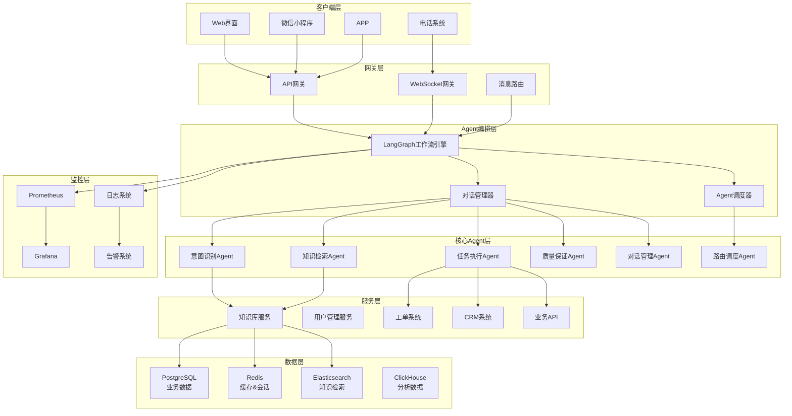

# 项目3：智能客服系统

> **项目背景**：构建一个基于多Agent协作的智能客服系统，能够自动处理客户咨询、路由请求、执行任务，并提供质量监控，掌握复杂Agent工作流设计和LangGraph应用。

## 🎯 项目概述

### 项目背景
传统客服系统依赖人工处理，成本高、效率低、服务质量不稳定。智能客服系统通过多个专业化Agent协作，能够自动理解用户意图、检索相关信息、执行具体任务，并保证服务质量，大幅提升客服效率和用户满意度。

### 核心价值
- **成本降低**：减少80%的人工客服工作量
- **24/7服务**：全天候不间断智能服务
- **一致性保证**：标准化服务流程和回复质量
- **数据驱动**：客户行为分析和服务优化
- **可扩展性**：支持多渠道、多语言、多业务场景

### 应用场景
- **电商客服**：订单查询、退换货处理、产品咨询
- **银行客服**：账户查询、转账操作、理财咨询
- **技术支持**：故障诊断、解决方案推荐、工单处理
- **政务服务**：政策咨询、办事流程、表单填写

## 📋 项目规格

### 功能需求

#### 核心Agent设计
| Agent角色 | 职责描述 | 核心能力 | 优先级 |
|-----------|----------|----------|--------|
| **意图识别Agent** | 理解用户真实需求和意图 | NLU、意图分类、实体提取 | P0 |
| **知识检索Agent** | 从知识库检索相关信息 | 语义搜索、知识匹配、内容推荐 | P0 |
| **任务执行Agent** | 执行具体的业务操作 | API调用、数据库操作、第三方集成 | P0 |
| **对话管理Agent** | 管理多轮对话和上下文 | 对话状态跟踪、上下文管理 | P0 |
| **质量保证Agent** | 监控和改善服务质量 | 回复质量评估、异常检测、升级决策 | P1 |
| **路由调度Agent** | 智能分配和调度请求 | 负载均衡、专家匹配、优先级处理 | P1 |

#### 系统功能模块
| 模块 | 功能描述 | 技术复杂度 | 业务价值 |
|------|----------|------------|----------|
| **多渠道接入** | 支持网页、微信、电话等 | ⭐⭐⭐ | 高 |
| **智能意图理解** | 准确识别用户意图和需求 | ⭐⭐⭐⭐ | 高 |
| **知识库管理** | 支持知识更新和维护 | ⭐⭐⭐ | 高 |
| **工作流编排** | 复杂业务流程自动化 | ⭐⭐⭐⭐⭐ | 高 |
| **实时监控** | 服务质量和系统状态监控 | ⭐⭐⭐⭐ | 中 |
| **数据分析** | 客户行为和服务效果分析 | ⭐⭐⭐ | 中 |
| **人工接管** | 复杂问题自动转人工 | ⭐⭐⭐ | 高 |

### 性能指标

#### 业务指标
- **问题解决率**：> 85%（无需人工干预）
- **客户满意度**：> 4.2/5.0
- **平均处理时间**：< 2分钟
- **首次解决率**：> 70%
- **人工转接率**：< 15%

#### 技术指标
- **意图识别准确率**：> 95%
- **知识检索召回率**：> 90%
- **系统响应时间**：< 3秒
- **并发处理能力**：> 1000请求/分钟
- **系统可用性**：> 99.9%

## 🛠️ 技术架构

### 技术栈选择

#### 核心技术栈
```python
# Agent框架
langgraph>=0.0.20           # 工作流编排
langchain>=0.0.350          # Agent开发框架
crewai>=0.1.0              # 多Agent协作（可选）

# Web框架
fastapi>=0.104.0           # 高性能API框架
websockets>=11.0           # WebSocket支持
celery>=5.3.0              # 异步任务队列

# 数据存储
redis>=4.6.0               # 缓存和会话存储
postgresql>=15             # 主数据库
elasticsearch>=8.0         # 搜索引擎
clickhouse>=23.0           # 分析数据库（可选）

# 消息队列
rabbitmq>=3.12             # 消息中间件
# 或 apache-kafka>=3.5     # 大规模消息处理

# 监控和日志
prometheus>=0.17.0         # 监控指标
grafana>=10.0             # 可视化面板
loguru>=0.7.0             # 日志管理
sentry>=1.34.0            # 错误追踪

# AI和NLP
transformers>=4.35.0       # 预训练模型
sentence-transformers>=2.2 # 句子嵌入
spacy>=3.7.0              # NLP处理
```

### 系统架构设计



### Agent工作流设计

#### 主工作流（LangGraph）
```python
from langgraph.graph import StateGraph, END
from typing import TypedDict, List, Dict, Any

class CustomerServiceState(TypedDict):
    """客服系统状态定义"""
    # 用户信息
    user_id: str
    session_id: str
    channel: str  # web, wechat, phone, etc.

    # 对话信息
    user_message: str
    conversation_history: List[Dict[str, str]]
    current_intent: str
    entities: Dict[str, Any]
    confidence_score: float

    # 检索信息
    retrieved_knowledge: List[Dict[str, Any]]
    search_queries: List[str]

    # 执行信息
    actions_taken: List[str]
    api_results: List[Dict[str, Any]]
    task_status: str

    # 质量信息
    quality_score: float
    escalation_needed: bool
    feedback_collected: bool

    # 输出信息
    final_response: str
    suggested_actions: List[str]
    follow_up_needed: bool

def create_customer_service_workflow():
    """创建客服工作流"""
    workflow = StateGraph(CustomerServiceState)

    # 添加节点
    workflow.add_node("intent_classification", classify_intent_node)
    workflow.add_node("knowledge_retrieval", retrieve_knowledge_node)
    workflow.add_node("context_understanding", understand_context_node)
    workflow.add_node("task_execution", execute_task_node)
    workflow.add_node("response_generation", generate_response_node)
    workflow.add_node("quality_check", check_quality_node)
    workflow.add_node("escalation_decision", decide_escalation_node)
    workflow.add_node("human_handoff", handoff_to_human_node)

    # 设置入口
    workflow.set_entry_point("intent_classification")

    # 添加条件边
    workflow.add_conditional_edges(
        "intent_classification",
        route_after_intent,
        {
            "simple_query": "knowledge_retrieval",
            "complex_task": "context_understanding",
            "escalation": "escalation_decision"
        }
    )

    workflow.add_edge("knowledge_retrieval", "response_generation")
    workflow.add_edge("context_understanding", "task_execution")
    workflow.add_edge("task_execution", "response_generation")
    workflow.add_edge("response_generation", "quality_check")

    workflow.add_conditional_edges(
        "quality_check",
        route_after_quality_check,
        {
            "good_quality": END,
            "poor_quality": "escalation_decision",
            "needs_improvement": "knowledge_retrieval"
        }
    )

    workflow.add_conditional_edges(
        "escalation_decision",
        route_escalation,
        {
            "escalate": "human_handoff",
            "retry": "intent_classification",
            "end": END
        }
    )

    workflow.add_edge("human_handoff", END)

    return workflow.compile()
```

## 💻 详细实现

### 核心Agent实现

#### 1. 意图识别Agent
```python
# app/agents/intent_agent.py
from typing import Dict, Any, List, Tuple
from transformers import pipeline
from langchain_openai import ChatOpenAI
from langchain.prompts import PromptTemplate
import spacy
import re
import logging

logger = logging.getLogger(__name__)

class IntentClassificationAgent:
    """意图识别Agent - 理解用户真实需求"""

    def __init__(self):
        self.llm = ChatOpenAI(
            model="gpt-4",
            temperature=0.1
        )

        # 预定义意图类别
        self.intent_categories = {
            "product_inquiry": "产品咨询",
            "order_status": "订单查询",
            "return_refund": "退换货",
            "technical_support": "技术支持",
            "complaint": "投诉建议",
            "account_issue": "账户问题",
            "billing_inquiry": "费用查询",
            "general_info": "一般信息",
            "escalation": "转人工"
        }

        # 加载NER模型
        self.nlp = spacy.load("zh_core_web_sm")

        # 设置意图识别提示模板
        self.intent_prompt = PromptTemplate(
            input_variables=["user_message", "conversation_history", "intent_categories"],
            template="""
你是一个专业的客服意图识别专家。请分析用户消息，准确识别用户的真实意图。

可用意图类别：
{intent_categories}

对话历史：
{conversation_history}

当前用户消息：
{user_message}

请返回JSON格式：
{{
    "primary_intent": "主要意图类别",
    "confidence": 0.0-1.0,
    "secondary_intents": ["次要意图1", "次要意图2"],
    "urgency_level": "low|medium|high",
    "reasoning": "识别依据",
    "entities": {{
        "product_name": "产品名称",
        "order_id": "订单号",
        "amount": "金额",
        "date": "日期"
    }}
}}
"""
        )

    async def classify_intent(
        self,
        user_message: str,
        conversation_history: List[Dict[str, str]] = None,
        user_context: Dict[str, Any] = None
    ) -> Dict[str, Any]:
        """
        分类用户意图

        Args:
            user_message: 用户消息
            conversation_history: 对话历史
            user_context: 用户上下文信息

        Returns:
            意图分析结果
        """
        try:
            # 1. 预处理用户消息
            cleaned_message = self._preprocess_message(user_message)

            # 2. 提取实体
            entities = self._extract_entities(cleaned_message)

            # 3. 准备对话历史
            history_text = self._format_conversation_history(conversation_history or [])

            # 4. 使用LLM进行意图识别
            intent_result = await self._llm_classify_intent(
                cleaned_message, history_text, entities
            )

            # 5. 后处理和验证
            validated_result = self._validate_intent_result(intent_result, entities)

            # 6. 添加额外信息
            validated_result.update({
                "original_message": user_message,
                "processed_message": cleaned_message,
                "extracted_entities": entities,
                "timestamp": self._get_timestamp(),
                "user_context": user_context
            })

            logger.info(f"Intent classified: {validated_result['primary_intent']} "
                       f"(confidence: {validated_result['confidence']})")

            return validated_result

        except Exception as e:
            logger.error(f"Intent classification failed: {e}")
            return self._get_fallback_intent(user_message)

    def _preprocess_message(self, message: str) -> str:
        """预处理用户消息"""
        # 移除多余空格
        message = re.sub(r'\s+', ' ', message.strip())

        # 标准化常见表达
        replacements = {
            r'咋办|怎么办|如何处理': '怎么处理',
            r'退货|退款': '退换货',
            r'人工|客服|转接': '转人工',
            r'投诉|意见|建议': '投诉建议'
        }

        for pattern, replacement in replacements.items():
            message = re.sub(pattern, replacement, message)

        return message

    def _extract_entities(self, message: str) -> Dict[str, Any]:
        """提取命名实体"""
        entities = {}

        try:
            # 使用spaCy进行NER
            doc = self.nlp(message)

            for ent in doc.ents:
                entity_type = ent.label_
                entity_value = ent.text

                if entity_type not in entities:
                    entities[entity_type] = []
                entities[entity_type].append(entity_value)

            # 使用正则表达式提取特定实体

            # 订单号
            order_patterns = [
                r'订单号[：:]?\s*([A-Z0-9]{10,20})',
                r'单号[：:]?\s*([A-Z0-9]{10,20})',
                r'流水号[：:]?\s*([A-Z0-9]{10,20})'
            ]
            for pattern in order_patterns:
                matches = re.findall(pattern, message, re.IGNORECASE)
                if matches:
                    entities['order_id'] = matches

            # 金额
            money_pattern = r'(\d+(?:\.\d{1,2})?)\s*元'
            money_matches = re.findall(money_pattern, message)
            if money_matches:
                entities['amount'] = [float(m) for m in money_matches]

            # 日期
            date_patterns = [
                r'(\d{4}年\d{1,2}月\d{1,2}日)',
                r'(\d{4}-\d{1,2}-\d{1,2})',
                r'(今天|昨天|前天)',
                r'(\d{1,2}月\d{1,2}日)'
            ]
            for pattern in date_patterns:
                matches = re.findall(pattern, message)
                if matches:
                    if 'date' not in entities:
                        entities['date'] = []
                    entities['date'].extend(matches)

            # 产品名称（简单关键词匹配）
            product_keywords = ['手机', '电脑', '耳机', '充电器', '键盘', '鼠标']
            for keyword in product_keywords:
                if keyword in message:
                    if 'product' not in entities:
                        entities['product'] = []
                    entities['product'].append(keyword)

        except Exception as e:
            logger.warning(f"Entity extraction failed: {e}")

        return entities

    async def _llm_classify_intent(
        self,
        message: str,
        history: str,
        entities: Dict[str, Any]
    ) -> Dict[str, Any]:
        """使用LLM进行意图分类"""

        # 格式化意图类别
        categories_text = "\n".join([
            f"- {key}: {value}"
            for key, value in self.intent_categories.items()
        ])

        # 构建提示
        prompt = self.intent_prompt.format(
            user_message=message,
            conversation_history=history,
            intent_categories=categories_text
        )

        # 调用LLM
        response = await self.llm.ainvoke(prompt)

        # 解析响应
        try:
            import json
            result = json.loads(response.content)
            return result
        except json.JSONDecodeError:
            # 如果JSON解析失败，使用正则表达式提取信息
            return self._parse_llm_response_fallback(response.content)

    def _parse_llm_response_fallback(self, response: str) -> Dict[str, Any]:
        """LLM响应解析失败时的备用方案"""

        # 尝试从响应中提取关键信息
        primary_intent = "general_info"  # 默认意图
        confidence = 0.5  # 默认置信度

        # 查找意图关键词
        for intent_key, intent_name in self.intent_categories.items():
            if intent_key in response.lower() or intent_name in response:
                primary_intent = intent_key
                confidence = 0.7
                break

        return {
            "primary_intent": primary_intent,
            "confidence": confidence,
            "secondary_intents": [],
            "urgency_level": "medium",
            "reasoning": "Fallback parsing",
            "entities": {}
        }

    def _validate_intent_result(
        self,
        result: Dict[str, Any],
        extracted_entities: Dict[str, Any]
    ) -> Dict[str, Any]:
        """验证和增强意图识别结果"""

        # 确保必需字段存在
        validated = {
            "primary_intent": result.get("primary_intent", "general_info"),
            "confidence": min(max(result.get("confidence", 0.5), 0.0), 1.0),
            "secondary_intents": result.get("secondary_intents", []),
            "urgency_level": result.get("urgency_level", "medium"),
            "reasoning": result.get("reasoning", ""),
            "entities": result.get("entities", {})
        }

        # 合并提取的实体
        for key, value in extracted_entities.items():
            if key not in validated["entities"]:
                validated["entities"][key] = value

        # 基于实体调整意图和置信度
        if "order_id" in validated["entities"] and "order" not in validated["primary_intent"]:
            validated["secondary_intents"].append("order_status")
            validated["confidence"] = min(validated["confidence"] + 0.1, 1.0)

        if "amount" in validated["entities"] and "billing" not in validated["primary_intent"]:
            validated["secondary_intents"].append("billing_inquiry")

        # 确保意图类别有效
        if validated["primary_intent"] not in self.intent_categories:
            validated["primary_intent"] = "general_info"
            validated["confidence"] = max(validated["confidence"] - 0.2, 0.1)

        return validated

    def _format_conversation_history(
        self,
        history: List[Dict[str, str]]
    ) -> str:
        """格式化对话历史"""
        if not history:
            return "无对话历史"

        formatted = []
        for item in history[-5:]:  # 只保留最近5轮对话
            role = item.get("role", "unknown")
            content = item.get("content", "")
            formatted.append(f"{role}: {content}")

        return "\n".join(formatted)

    def _get_fallback_intent(self, message: str) -> Dict[str, Any]:
        """获取备用意图结果"""
        return {
            "primary_intent": "general_info",
            "confidence": 0.3,
            "secondary_intents": [],
            "urgency_level": "low",
            "reasoning": "Fallback due to processing error",
            "entities": {},
            "original_message": message,
            "processed_message": message,
            "extracted_entities": {},
            "timestamp": self._get_timestamp(),
            "error": True
        }

    def _get_timestamp(self) -> str:
        """获取当前时间戳"""
        from datetime import datetime
        return datetime.now().isoformat()

    async def update_intent_with_feedback(
        self,
        session_id: str,
        feedback: Dict[str, Any]
    ) -> bool:
        """根据反馈更新意图识别"""
        try:
            # 这里可以实现在线学习逻辑
            # 例如：更新意图分类模型、调整规则等
            logger.info(f"Intent feedback received for session {session_id}: {feedback}")
            return True
        except Exception as e:
            logger.error(f"Failed to update intent with feedback: {e}")
            return False
```

#### 2. 知识检索Agent
```python
# app/agents/knowledge_agent.py
from typing import List, Dict, Any, Optional, Tuple
from langchain.schema import Document
from app.services.vector_store import VectorStoreService
from app.services.cache import CacheService
import logging

logger = logging.getLogger(__name__)

class KnowledgeRetrievalAgent:
    """知识检索Agent - 从知识库检索相关信息"""

    def __init__(self):
        self.vector_store = VectorStoreService()
        self.cache = CacheService()

        # 不同意图的检索策略
        self.retrieval_strategies = {
            "product_inquiry": self._product_inquiry_strategy,
            "order_status": self._order_status_strategy,
            "return_refund": self._return_refund_strategy,
            "technical_support": self._technical_support_strategy,
            "billing_inquiry": self._billing_inquiry_strategy,
            "general_info": self._general_info_strategy
        }

    async def retrieve_knowledge(
        self,
        intent_result: Dict[str, Any],
        conversation_context: Dict[str, Any] = None
    ) -> Dict[str, Any]:
        """
        基于意图检索相关知识

        Args:
            intent_result: 意图识别结果
            conversation_context: 对话上下文

        Returns:
            检索结果
        """
        try:
            primary_intent = intent_result.get("primary_intent", "general_info")
            user_message = intent_result.get("original_message", "")
            entities = intent_result.get("entities", {})

            # 检查缓存
            cache_key = self._generate_cache_key(intent_result)
            cached_result = await self.cache.get(cache_key)
            if cached_result:
                logger.info(f"Knowledge retrieved from cache: {cache_key}")
                return cached_result

            # 选择检索策略
            strategy = self.retrieval_strategies.get(
                primary_intent,
                self._general_info_strategy
            )

            # 执行检索
            retrieval_result = await strategy(
                user_message, entities, conversation_context
            )

            # 后处理结果
            processed_result = self._post_process_results(
                retrieval_result, intent_result
            )

            # 缓存结果
            await self.cache.set(cache_key, processed_result, ttl=1800)  # 30分钟

            logger.info(f"Knowledge retrieved: {len(processed_result['documents'])} documents")
            return processed_result

        except Exception as e:
            logger.error(f"Knowledge retrieval failed: {e}")
            return self._get_fallback_result()

    async def _product_inquiry_strategy(
        self,
        message: str,
        entities: Dict[str, Any],
        context: Dict[str, Any] = None
    ) -> Dict[str, Any]:
        """产品咨询检索策略"""

        # 构建查询
        queries = [message]

        # 基于实体优化查询
        if 'product' in entities:
            for product in entities['product']:
                queries.append(f"{product} 产品介绍")
                queries.append(f"{product} 功能特性")
                queries.append(f"{product} 价格信息")

        # 执行多查询检索
        all_docs = []
        for query in queries[:3]:  # 限制查询数量
            docs = await self.vector_store.similarity_search(
                query=query,
                k=3,
                filter={"document_type": "product_info"}
            )
            all_docs.extend(docs)

        # 去重和重排序
        unique_docs = self._deduplicate_documents(all_docs)
        ranked_docs = self._rank_documents(unique_docs, message)

        return {
            "documents": ranked_docs[:5],
            "queries_used": queries,
            "strategy": "product_inquiry"
        }

    async def _order_status_strategy(
        self,
        message: str,
        entities: Dict[str, Any],
        context: Dict[str, Any] = None
    ) -> Dict[str, Any]:
        """订单状态检索策略"""

        # 如果有订单号，直接查询订单系统
        if 'order_id' in entities:
            # 这里可以调用订单系统API
            order_docs = await self._query_order_system(entities['order_id'])
            if order_docs:
                return {
                    "documents": order_docs,
                    "queries_used": [f"order_id:{entities['order_id']}"],
                    "strategy": "order_status",
                    "data_source": "order_system"
                }

        # 否则检索订单相关知识
        queries = [
            message,
            "订单查询流程",
            "订单状态说明"
        ]

        all_docs = []
        for query in queries:
            docs = await self.vector_store.similarity_search(
                query=query,
                k=2,
                filter={"document_type": "order_help"}
            )
            all_docs.extend(docs)

        return {
            "documents": self._deduplicate_documents(all_docs)[:3],
            "queries_used": queries,
            "strategy": "order_status"
        }

    async def _technical_support_strategy(
        self,
        message: str,
        entities: Dict[str, Any],
        context: Dict[str, Any] = None
    ) -> Dict[str, Any]:
        """技术支持检索策略"""

        # 构建技术问题相关查询
        queries = [message]

        # 添加常见技术问题查询
        tech_keywords = ['故障', '问题', '错误', '无法', '不能']
        if any(keyword in message for keyword in tech_keywords):
            queries.extend([
                f"{message} 解决方案",
                f"{message} 故障排除",
                "常见技术问题"
            ])

        # 基于产品实体添加特定查询
        if 'product' in entities:
            for product in entities['product']:
                queries.append(f"{product} 技术支持")
                queries.append(f"{product} 使用说明")

        # 执行检索
        all_docs = []
        for query in queries[:4]:
            docs = await self.vector_store.similarity_search(
                query=query,
                k=3,
                filter={"document_type": "technical_support"}
            )
            all_docs.extend(docs)

        # 重排序（技术支持文档按相关性和权威性排序）
        ranked_docs = self._rank_technical_docs(all_docs, message)

        return {
            "documents": ranked_docs[:5],
            "queries_used": queries,
            "strategy": "technical_support"
        }

    async def _general_info_strategy(
        self,
        message: str,
        entities: Dict[str, Any],
        context: Dict[str, Any] = None
    ) -> Dict[str, Any]:
        """通用信息检索策略"""

        # 基础语义检索
        docs = await self.vector_store.similarity_search(
            query=message,
            k=4
        )

        return {
            "documents": docs,
            "queries_used": [message],
            "strategy": "general_info"
        }

    def _deduplicate_documents(self, documents: List[Document]) -> List[Document]:
        """去重文档"""
        seen_content = set()
        unique_docs = []

        for doc in documents:
            content_hash = hash(doc.page_content[:200])  # 使用前200字符计算哈希
            if content_hash not in seen_content:
                seen_content.add(content_hash)
                unique_docs.append(doc)

        return unique_docs

    def _rank_documents(
        self,
        documents: List[Document],
        query: str
    ) -> List[Document]:
        """重排序文档"""
        # 简单的基于关键词匹配的排序
        query_words = set(query.lower().split())

        def score_doc(doc):
            content_words = set(doc.page_content.lower().split())
            # 计算关键词重叠度
            overlap = len(query_words.intersection(content_words))
            # 考虑文档长度
            length_penalty = len(doc.page_content) / 1000
            return overlap - length_penalty * 0.1

        return sorted(documents, key=score_doc, reverse=True)

    def _rank_technical_docs(
        self,
        documents: List[Document],
        query: str
    ) -> List[Document]:
        """技术文档特殊排序"""
        def score_tech_doc(doc):
            content = doc.page_content.lower()
            score = 0

            # 解决方案类文档加分
            if any(word in content for word in ['解决', '方案', '步骤']):
                score += 2

            # 官方文档加分
            if doc.metadata.get('source_type') == 'official':
                score += 1

            # 最新文档加分
            if doc.metadata.get('is_latest', False):
                score += 1

            return score

        return sorted(documents, key=score_tech_doc, reverse=True)

    async def _query_order_system(self, order_ids: List[str]) -> List[Document]:
        """查询订单系统"""
        # 这里应该调用实际的订单系统API
        # 示例实现
        order_docs = []

        for order_id in order_ids[:1]:  # 只处理第一个订单号
            try:
                # 模拟API调用
                order_info = {
                    "order_id": order_id,
                    "status": "已发货",
                    "tracking_number": "SF1234567890",
                    "estimated_delivery": "2024-10-15"
                }

                content = f"""
订单号：{order_info['order_id']}
订单状态：{order_info['status']}
快递单号：{order_info['tracking_number']}
预计送达：{order_info['estimated_delivery']}
"""

                doc = Document(
                    page_content=content,
                    metadata={
                        "source": "order_system",
                        "order_id": order_id,
                        "data_type": "real_time"
                    }
                )

                order_docs.append(doc)

            except Exception as e:
                logger.error(f"Failed to query order {order_id}: {e}")

        return order_docs

    def _generate_cache_key(self, intent_result: Dict[str, Any]) -> str:
        """生成缓存键"""
        import hashlib

        # 基于意图、消息和实体生成缓存键
        key_parts = [
            intent_result.get("primary_intent", ""),
            intent_result.get("processed_message", ""),
            str(sorted(intent_result.get("entities", {}).items()))
        ]

        key_string = "|".join(key_parts)
        return f"knowledge_cache:{hashlib.md5(key_string.encode()).hexdigest()}"

    def _post_process_results(
        self,
        retrieval_result: Dict[str, Any],
        intent_result: Dict[str, Any]
    ) -> Dict[str, Any]:
        """后处理检索结果"""

        # 添加元信息
        retrieval_result.update({
            "intent": intent_result.get("primary_intent"),
            "confidence": intent_result.get("confidence"),
            "timestamp": self._get_timestamp(),
            "total_documents": len(retrieval_result.get("documents", []))
        })

        # 过滤空文档
        documents = retrieval_result.get("documents", [])
        filtered_docs = [
            doc for doc in documents
            if doc.page_content.strip()
        ]
        retrieval_result["documents"] = filtered_docs

        return retrieval_result

    def _get_fallback_result(self) -> Dict[str, Any]:
        """获取备用检索结果"""
        return {
            "documents": [],
            "queries_used": [],
            "strategy": "fallback",
            "error": True,
            "timestamp": self._get_timestamp()
        }

    def _get_timestamp(self) -> str:
        """获取当前时间戳"""
        from datetime import datetime
        return datetime.now().isoformat()
```

### 监控和质量保证

#### 质量保证Agent
```python
# app/agents/quality_agent.py
from typing import Dict, Any, List, Optional
from langchain_openai import ChatOpenAI
from langchain.prompts import PromptTemplate
import logging

logger = logging.getLogger(__name__)

class QualityAssuranceAgent:
    """质量保证Agent - 监控和改善服务质量"""

    def __init__(self):
        self.llm = ChatOpenAI(model="gpt-4", temperature=0.1)

        # 质量评估维度
        self.quality_dimensions = {
            "relevance": "回答相关性",
            "accuracy": "信息准确性",
            "completeness": "回答完整性",
            "clarity": "表达清晰度",
            "helpfulness": "实用性",
            "tone": "语调合适性"
        }

        # 质量评估提示模板
        self.quality_prompt = PromptTemplate(
            input_variables=["user_question", "agent_response", "retrieved_knowledge"],
            template="""
请评估客服Agent回复的质量。

用户问题：
{user_question}

Agent回复：
{agent_response}

参考知识：
{retrieved_knowledge}

请从以下维度评分（1-5分）：
1. 相关性：回答是否直接相关用户问题
2. 准确性：信息是否准确无误
3. 完整性：回答是否完整解决问题
4. 清晰度：表达是否清晰易懂
5. 实用性：是否对用户有实际帮助
6. 语调：是否友好专业

返回JSON格式：
{{
    "overall_score": 总分(1-5),
    "dimension_scores": {{
        "relevance": 分数,
        "accuracy": 分数,
        "completeness": 分数,
        "clarity": 分数,
        "helpfulness": 分数,
        "tone": 分数
    }},
    "strengths": ["优点1", "优点2"],
    "weaknesses": ["不足1", "不足2"],
    "improvement_suggestions": ["建议1", "建议2"],
    "escalation_needed": true/false,
    "escalation_reason": "升级原因"
}}
"""
        )

    async def evaluate_response_quality(
        self,
        user_question: str,
        agent_response: str,
        retrieved_knowledge: List[Dict[str, Any]],
        conversation_context: Dict[str, Any] = None
    ) -> Dict[str, Any]:
        """评估响应质量"""

        try:
            # 格式化检索知识
            knowledge_text = self._format_retrieved_knowledge(retrieved_knowledge)

            # 构建评估提示
            prompt = self.quality_prompt.format(
                user_question=user_question,
                agent_response=agent_response,
                retrieved_knowledge=knowledge_text
            )

            # 调用LLM进行评估
            response = await self.llm.ainvoke(prompt)

            # 解析评估结果
            quality_result = self._parse_quality_response(response.content)

            # 添加额外信息
            quality_result.update({
                "timestamp": self._get_timestamp(),
                "evaluator": "quality_agent",
                "conversation_context": conversation_context
            })

            # 记录质量评估结果
            self._log_quality_assessment(quality_result)

            return quality_result

        except Exception as e:
            logger.error(f"Quality evaluation failed: {e}")
            return self._get_fallback_quality_result()

    def _format_retrieved_knowledge(
        self,
        knowledge: List[Dict[str, Any]]
    ) -> str:
        """格式化检索知识"""
        if not knowledge:
            return "无参考知识"

        formatted = []
        for i, item in enumerate(knowledge[:3], 1):
            if isinstance(item, dict) and 'page_content' in item:
                content = item['page_content'][:200] + "..."
                source = item.get('metadata', {}).get('source', '未知来源')
                formatted.append(f"{i}. [{source}] {content}")

        return "\n".join(formatted)

    def _parse_quality_response(self, response: str) -> Dict[str, Any]:
        """解析质量评估响应"""
        try:
            import json
            return json.loads(response)
        except json.JSONDecodeError:
            # 备用解析方案
            return self._extract_quality_info_fallback(response)

    def _extract_quality_info_fallback(self, response: str) -> Dict[str, Any]:
        """质量评估响应解析失败时的备用方案"""

        # 尝试提取分数
        import re

        overall_score = 3.0  # 默认分数
        escalation_needed = False

        # 查找总分
        score_match = re.search(r'总分[：:]?\s*(\d+(?:\.\d+)?)', response)
        if score_match:
            overall_score = float(score_match.group(1))

        # 判断是否需要升级
        if overall_score < 2.5 or "升级" in response or "人工" in response:
            escalation_needed = True

        return {
            "overall_score": overall_score,
            "dimension_scores": {dim: overall_score for dim in self.quality_dimensions},
            "strengths": ["评估信息提取失败"],
            "weaknesses": ["评估信息提取失败"],
            "improvement_suggestions": ["建议重新评估"],
            "escalation_needed": escalation_needed,
            "escalation_reason": "评估异常" if escalation_needed else None,
            "parsing_failed": True
        }

    def _log_quality_assessment(self, quality_result: Dict[str, Any]):
        """记录质量评估结果"""
        logger.info(f"Quality assessment completed: "
                   f"Overall score: {quality_result.get('overall_score', 'N/A')}, "
                   f"Escalation needed: {quality_result.get('escalation_needed', False)}")

    def _get_fallback_quality_result(self) -> Dict[str, Any]:
        """获取备用质量评估结果"""
        return {
            "overall_score": 3.0,
            "dimension_scores": {dim: 3.0 for dim in self.quality_dimensions},
            "strengths": [],
            "weaknesses": ["质量评估失败"],
            "improvement_suggestions": ["需要人工检查"],
            "escalation_needed": True,
            "escalation_reason": "质量评估系统异常",
            "error": True,
            "timestamp": self._get_timestamp()
        }

    def _get_timestamp(self) -> str:
        """获取当前时间戳"""
        from datetime import datetime
        return datetime.now().isoformat()

    async def collect_user_feedback(
        self,
        session_id: str,
        feedback_data: Dict[str, Any]
    ) -> bool:
        """收集用户反馈"""
        try:
            # 存储用户反馈
            logger.info(f"User feedback collected for session {session_id}: {feedback_data}")

            # 这里可以将反馈存储到数据库
            # await self.feedback_service.store_feedback(session_id, feedback_data)

            return True
        except Exception as e:
            logger.error(f"Failed to collect user feedback: {e}")
            return False
```

## 🚀 部署和监控

### 生产环境部署

#### Kubernetes配置
```yaml
# k8s/customer-service-deployment.yaml
apiVersion: apps/v1
kind: Deployment
metadata:
  name: customer-service-app
  namespace: customer-service
spec:
  replicas: 3
  selector:
    matchLabels:
      app: customer-service
  template:
    metadata:
      labels:
        app: customer-service
    spec:
      containers:
      - name: app
        image: customer-service:latest
        ports:
        - containerPort: 8000
        env:
        - name: OPENAI_API_KEY
          valueFrom:
            secretKeyRef:
              name: ai-secrets
              key: openai-api-key
        - name: DATABASE_URL
          valueFrom:
            secretKeyRef:
              name: db-secrets
              key: database-url
        resources:
          requests:
            memory: "512Mi"
            cpu: "500m"
          limits:
            memory: "1Gi"
            cpu: "1000m"
        livenessProbe:
          httpGet:
            path: /health
            port: 8000
          initialDelaySeconds: 30
          periodSeconds: 10
        readinessProbe:
          httpGet:
            path: /ready
            port: 8000
          initialDelaySeconds: 5
          periodSeconds: 5

---
apiVersion: v1
kind: Service
metadata:
  name: customer-service-service
  namespace: customer-service
spec:
  selector:
    app: customer-service
  ports:
  - port: 80
    targetPort: 8000
  type: ClusterIP
```

### 监控配置

#### Prometheus配置
```yaml
# monitoring/prometheus-config.yaml
apiVersion: v1
kind: ConfigMap
metadata:
  name: prometheus-config
data:
  prometheus.yml: |
    global:
      scrape_interval: 15s

    scrape_configs:
    - job_name: 'customer-service'
      static_configs:
      - targets: ['customer-service-service:80']
      metrics_path: /metrics
      scrape_interval: 10s

    - job_name: 'redis'
      static_configs:
      - targets: ['redis-service:6379']

    - job_name: 'postgres'
      static_configs:
      - targets: ['postgres-service:5432']

    rule_files:
    - "/etc/prometheus/rules/*.yml"

    alerting:
      alertmanagers:
      - static_configs:
        - targets: ['alertmanager:9093']
```

## 📊 项目评估

### 成功指标

#### 业务KPI
- [ ] **问题解决率** > 85%
- [ ] **客户满意度** > 4.2/5.0
- [ ] **平均处理时间** < 2分钟
- [ ] **人工转接率** < 15%
- [ ] **成本降低** > 60%

#### 技术KPI
- [ ] **意图识别准确率** > 95%
- [ ] **知识检索召回率** > 90%
- [ ] **系统响应时间** < 3秒
- [ ] **系统可用性** > 99.9%
- [ ] **并发处理能力** > 1000 QPS

### 测试验收

#### 功能测试
```python
# tests/test_customer_service_workflow.py
import pytest
from app.workflows.customer_service import CustomerServiceWorkflow

@pytest.mark.asyncio
async def test_simple_product_inquiry():
    """测试简单产品咨询"""
    workflow = CustomerServiceWorkflow()

    input_state = {
        "user_message": "iPhone 15 Pro有什么特色功能？",
        "user_id": "test_user_001",
        "session_id": "test_session_001",
        "channel": "web"
    }

    result = await workflow.process(input_state)

    assert result["primary_intent"] == "product_inquiry"
    assert result["final_response"] is not None
    assert result["quality_score"] > 3.0
    assert not result["escalation_needed"]

@pytest.mark.asyncio
async def test_order_status_inquiry():
    """测试订单状态查询"""
    workflow = CustomerServiceWorkflow()

    input_state = {
        "user_message": "我的订单号ORD123456789现在什么状态？",
        "user_id": "test_user_002",
        "session_id": "test_session_002",
        "channel": "wechat"
    }

    result = await workflow.process(input_state)

    assert result["primary_intent"] == "order_status"
    assert "ORD123456789" in result["entities"]["order_id"]
    assert result["final_response"] is not None
```

## 🔄 扩展方向

### 短期扩展（2-3周）
1. **多渠道集成**：微信、钉钉、电话系统
2. **语音支持**：语音转文字、文字转语音
3. **情感分析**：识别用户情绪，调整回复策略

### 中期扩展（1-2个月）
1. **知识图谱**：构建产品、客户、问题关系图谱
2. **个性化服务**：基于用户画像的个性化回复
3. **预测分析**：预测客户需求和问题

### 长期扩展（3-6个月）
1. **多语言支持**：国际化客服系统
2. **视频客服**：视频通话和屏幕共享
3. **AI训练平台**：自动化模型训练和优化

---

**项目完成标志**：成功部署多Agent客服系统，处理真实客户咨询场景，各项KPI达标，为下阶段团队协作项目积累经验。

*预计完成时间：3周 | 难度等级：⭐⭐⭐⭐ | 前置要求：前两个项目完成，熟悉LangGraph*