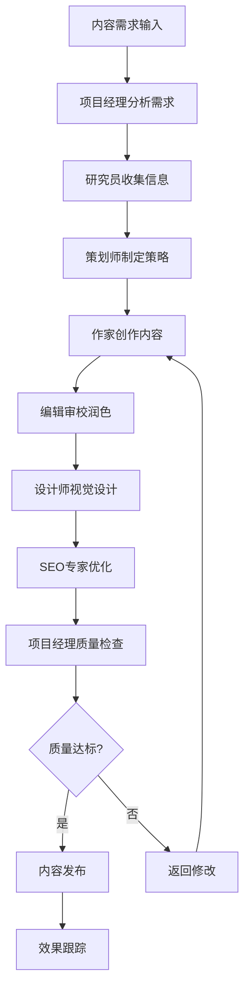
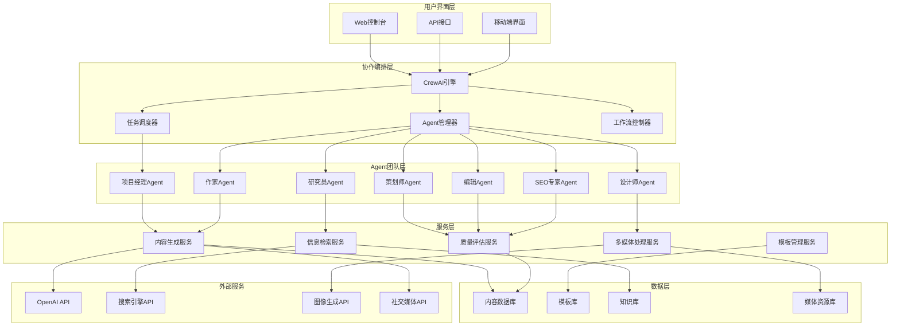

# 项目4：内容创作团队

> **项目背景**：构建一个基于CrewAI的多Agent内容创作团队，模拟真实的内容制作流程，包括研究、策划、写作、编辑、设计等角色协作，实现高质量内容的自动化生产。

## 🎯 项目概述

### 项目背景
内容创作是现代企业营销和传播的核心，但传统的内容制作流程耗时长、成本高、质量不稳定。通过AI Agent团队协作，可以模拟专业内容团队的工作流程，实现从主题研究到最终发布的全流程自动化，大幅提升内容制作效率和质量。

### 核心价值
- **效率提升**：将内容制作时间从天缩短到小时
- **质量保证**：多Agent协作确保内容专业性和准确性
- **成本控制**：减少70%以上的人力成本
- **规模化生产**：支持大批量内容并行制作
- **个性化定制**：根据不同平台和受众调整内容风格

### 应用场景
- **营销内容**：产品介绍、营销文案、社交媒体内容
- **技术文档**：用户手册、API文档、教程指南
- **新闻资讯**：行业报告、新闻稿、分析文章
- **教育内容**：课程内容、学习资料、考试题目
- **创意写作**：故事创作、剧本编写、广告创意

## 📋 项目规格

### 团队角色设计

#### 核心Agent角色
| 角色 | 职责描述 | 核心技能 | 协作方式 |
|------|----------|----------|----------|
| **项目经理Agent** | 统筹规划，分配任务，协调进度 | 项目管理、任务分解、质量控制 | 领导者 |
| **研究员Agent** | 主题研究，数据收集，趋势分析 | 信息检索、数据分析、事实核查 | 信息提供者 |
| **策划师Agent** | 内容策略，结构设计，受众分析 | 内容策略、用户画像、传播规划 | 战略制定者 |
| **作家Agent** | 内容创作，文案撰写，风格控制 | 创意写作、文案技巧、语言表达 | 内容生产者 |
| **编辑Agent** | 内容审校，风格统一，质量把控 | 文字编辑、逻辑检查、风格调整 | 质量控制者 |
| **设计师Agent** | 视觉设计，图表制作，排版优化 | 视觉设计、图表生成、版面布局 | 视觉呈现者 |
| **SEO专家Agent** | 搜索优化，关键词布局，流量优化 | SEO策略、关键词研究、流量分析 | 优化专家 |

#### 扩展角色（可选）
| 角色 | 职责 | 应用场景 |
|------|------|----------|
| **翻译Agent** | 多语言内容制作 | 国际化内容 |
| **数据分析师Agent** | 内容效果分析 | 内容运营 |
| **审核Agent** | 合规性检查 | 敏感内容 |
| **社交媒体专家Agent** | 平台内容优化 | 社交媒体运营 |

### 工作流程设计

#### 标准内容制作流程


### 技术需求

#### 功能模块
| 模块 | 功能描述 | 技术复杂度 | 优先级 |
|------|----------|------------|--------|
| **Agent协作引擎** | CrewAI团队协作和任务分配 | ⭐⭐⭐⭐⭐ | P0 |
| **内容生成** | 多种格式内容自动生成 | ⭐⭐⭐⭐ | P0 |
| **知识检索** | 实时信息搜索和事实核查 | ⭐⭐⭐ | P0 |
| **质量评估** | 内容质量自动评估和优化 | ⭐⭐⭐⭐ | P0 |
| **模板管理** | 多种内容模板和风格库 | ⭐⭐⭐ | P1 |
| **多媒体处理** | 图片、图表、视频处理 | ⭐⭐⭐⭐ | P1 |
| **协作界面** | 可视化团队协作界面 | ⭐⭐⭐ | P1 |
| **版本控制** | 内容版本管理和回滚 | ⭐⭐ | P2 |

#### 性能指标
- **内容生成速度**：完整文章 < 10分钟
- **质量一致性**：95%以上内容达到发布标准
- **团队协作效率**：多Agent并行工作，无阻塞
- **扩展性**：支持10+Agent同时协作
- **准确性**：事实性错误率 < 2%

## 🛠️ 技术架构

### 技术栈选择

#### 核心技术栈
```python
# 多Agent协作框架
crewai>=0.1.0              # 主要协作框架
langchain>=0.0.350         # LLM应用框架
langgraph>=0.0.20          # 工作流编排（备选）

# 内容生成
openai>=1.3.0              # GPT模型
anthropic>=0.7.0           # Claude模型（备选）
together>=0.2.0            # 开源模型API

# 信息检索
requests>=2.31.0           # HTTP请求
beautifulsoup4>=4.12.0     # 网页解析
newspaper3k>=0.2.8         # 新闻文章提取
serpapi>=1.1.0             # Google搜索API

# 内容处理
markdown>=3.5.0            # Markdown处理
python-docx>=0.8.11        # Word文档处理
reportlab>=4.0.0           # PDF生成
pillow>=10.0.0             # 图像处理

# 数据分析
pandas>=2.0.0              # 数据处理
matplotlib>=3.7.0          # 图表生成
seaborn>=0.12.0           # 统计图表
wordcloud>=1.9.0          # 词云生成

# Web框架
streamlit>=1.28.0          # 快速界面开发
fastapi>=0.104.0          # API服务
uvicorn>=0.24.0           # ASGI服务器

# 工具和集成
jinja2>=3.1.0             # 模板引擎
pydantic>=2.4.0           # 数据验证
python-dotenv>=1.0.0      # 环境变量
loguru>=0.7.0             # 日志管理
```

### 系统架构设计



## 💻 详细实现

### 环境搭建

#### 项目结构
```
content-creation-team/
├── README.md
├── requirements.txt
├── docker-compose.yml
├── .env.example
├── app/
│   ├── __init__.py
│   ├── main.py                    # FastAPI应用入口
│   ├── config.py                  # 配置管理
│   ├── agents/                    # Agent实现
│   │   ├── __init__.py
│   │   ├── project_manager.py     # 项目经理Agent
│   │   ├── researcher.py          # 研究员Agent
│   │   ├── strategist.py          # 策划师Agent
│   │   ├── writer.py              # 作家Agent
│   │   ├── editor.py              # 编辑Agent
│   │   ├── designer.py            # 设计师Agent
│   │   └── seo_expert.py          # SEO专家Agent
│   ├── crews/                     # 团队配置
│   │   ├── __init__.py
│   │   ├── content_crew.py        # 内容创作团队
│   │   └── specialized_crews.py   # 专业化团队
│   ├── tools/                     # 工具实现
│   │   ├── __init__.py
│   │   ├── research_tools.py      # 研究工具
│   │   ├── writing_tools.py       # 写作工具
│   │   ├── design_tools.py        # 设计工具
│   │   └── seo_tools.py           # SEO工具
│   ├── services/                  # 业务服务
│   │   ├── __init__.py
│   │   ├── content_service.py     # 内容服务
│   │   ├── quality_service.py     # 质量服务
│   │   └── template_service.py    # 模板服务
│   ├── models/                    # 数据模型
│   │   ├── __init__.py
│   │   ├── content.py             # 内容模型
│   │   └── task.py                # 任务模型
│   └── utils/                     # 工具函数
│       ├── __init__.py
│       ├── content_utils.py       # 内容工具
│       └── file_utils.py          # 文件工具
├── frontend/                      # 前端界面
│   ├── streamlit_app.py           # Streamlit应用
│   ├── components/                # 界面组件
│   └── static/                    # 静态资源
├── templates/                     # 内容模板
│   ├── articles/                  # 文章模板
│   ├── marketing/                 # 营销模板
│   └── reports/                   # 报告模板
├── outputs/                       # 输出内容
│   ├── articles/                  # 生成文章
│   ├── images/                    # 生成图片
│   └── reports/                   # 生成报告
├── tests/                         # 测试文件
│   ├── test_agents.py             # Agent测试
│   ├── test_crews.py              # 团队测试
│   └── test_integration.py        # 集成测试
└── docs/                          # 文档
    ├── agent_guide.md             # Agent指南
    └── workflow_guide.md          # 工作流指南
```

### 核心Agent实现

#### 1. 项目经理Agent
```python
# app/agents/project_manager.py
from crewai import Agent
from langchain_openai import ChatOpenAI
from typing import Dict, Any, List
import logging

logger = logging.getLogger(__name__)

class ProjectManagerAgent:
    """项目经理Agent - 统筹规划和协调"""

    @staticmethod
    def create_agent() -> Agent:
        """创建项目经理Agent"""

        return Agent(
            role='项目经理',
            goal='统筹整个内容创作项目，确保高质量交付',
            backstory="""
你是一位经验丰富的内容项目经理，拥有10年以上的内容制作和团队管理经验。
你擅长：
- 理解客户需求并制定详细的项目计划
- 协调不同专业背景的团队成员
- 把控项目质量和进度
- 识别潜在风险并制定应对策略
- 确保最终交付物符合客户期望

你的管理风格注重细节，善于沟通，能够在保证质量的前提下提高团队效率。
""",
            verbose=True,
            allow_delegation=True,  # 允许委托任务
            llm=ChatOpenAI(model="gpt-4", temperature=0.3),
            max_iter=3,
            memory=True
        )

    @staticmethod
    def create_planning_task(content_requirements: Dict[str, Any]) -> Dict[str, Any]:
        """创建项目规划任务"""

        return {
            'description': f"""
基于以下内容需求，制定详细的项目计划：

内容需求：
- 主题：{content_requirements.get('topic', '未指定')}
- 类型：{content_requirements.get('content_type', '未指定')}
- 目标受众：{content_requirements.get('target_audience', '未指定')}
- 字数要求：{content_requirements.get('word_count', '未指定')}
- 发布平台：{content_requirements.get('platform', '未指定')}
- 截止时间：{content_requirements.get('deadline', '未指定')}
- 特殊要求：{content_requirements.get('special_requirements', '无')}

请制定包含以下内容的项目计划：
1. 项目目标和成功指标
2. 详细任务分解和时间安排
3. 团队成员分工和职责
4. 质量标准和检查点
5. 风险识别和应对措施
6. 交付物清单和验收标准

输出格式：结构化的项目计划文档
""",
            'expected_output': """
详细的项目计划，包括：
- 项目概要
- 任务时间线
- 团队分工
- 质量标准
- 风险管控
- 交付清单
""",
            'agent': ProjectManagerAgent.create_agent()
        }

    @staticmethod
    def create_coordination_task() -> Dict[str, Any]:
        """创建团队协调任务"""

        return {
            'description': """
协调团队成员的工作，确保项目顺利进行：

1. 监控各团队成员的工作进度
2. 识别和解决团队协作中的问题
3. 确保信息在团队成员间有效传递
4. 调整资源分配以应对变化
5. 维护项目时间线和质量标准
6. 准备阶段性汇报和最终验收

重点关注：
- 工作质量是否达标
- 进度是否符合预期
- 团队协作是否顺畅
- 是否需要额外资源
""",
            'expected_output': """
团队协调报告，包括：
- 进度状态更新
- 质量检查结果
- 问题识别和解决方案
- 资源调整建议
- 下阶段工作安排
""",
            'agent': ProjectManagerAgent.create_agent()
        }

    @staticmethod
    def create_quality_review_task() -> Dict[str, Any]:
        """创建质量审查任务"""

        return {
            'description': """
对团队完成的内容进行全面的质量审查：

1. 内容质量评估
   - 是否符合项目要求
   - 内容准确性和专业性
   - 逻辑结构是否清晰
   - 语言表达是否流畅

2. 格式规范检查
   - 排版是否规范
   - 图片质量是否达标
   - 链接是否有效
   - SEO优化是否到位

3. 品牌一致性检查
   - 风格是否统一
   - 调性是否合适
   - 品牌信息是否准确

4. 最终交付准备
   - 整理所有交付物
   - 准备项目总结
   - 制定改进建议
""",
            'expected_output': """
质量审查报告和最终交付物，包括：
- 质量评估结果
- 发现的问题和改进建议
- 最终内容文件
- 项目总结报告
- 后续优化建议
""",
            'agent': ProjectManagerAgent.create_agent()
        }
```

#### 2. 研究员Agent
```python
# app/agents/researcher.py
from crewai import Agent, Tool
from langchain_openai import ChatOpenAI
from app.tools.research_tools import ResearchTools
from typing import Dict, Any, List
import logging

logger = logging.getLogger(__name__)

class ResearcherAgent:
    """研究员Agent - 信息收集和分析"""

    @staticmethod
    def create_agent() -> Agent:
        """创建研究员Agent"""

        # 创建研究工具
        tools = ResearchTools.get_all_tools()

        return Agent(
            role='资深研究员',
            goal='收集和分析相关信息，为内容创作提供可靠的数据支撑',
            backstory="""
你是一位专业的内容研究员，具有新闻学和信息科学双重背景。
你擅长：
- 快速定位和收集相关信息源
- 分析信息的可靠性和权威性
- 识别行业趋势和热点话题
- 进行竞品分析和市场调研
- 整理和总结复杂信息
- 事实核查和数据验证

你有强烈的求真精神，注重信息的准确性和时效性，善于从海量信息中提取关键洞察。
""",
            tools=tools,
            verbose=True,
            llm=ChatOpenAI(model="gpt-4", temperature=0.1),
            max_iter=5,
            memory=True
        )

    @staticmethod
    def create_research_task(topic: str, requirements: Dict[str, Any]) -> Dict[str, Any]:
        """创建研究任务"""

        return {
            'description': f"""
针对主题"{topic}"进行深度研究，收集以下信息：

研究重点：
1. 主题背景和定义
   - 基本概念和定义
   - 发展历史和现状
   - 相关统计数据

2. 最新趋势和动态
   - 最新发展动态
   - 行业趋势分析
   - 专家观点和评论

3. 目标受众分析
   - 受众特征和需求
   - 关注点和痛点
   - 偏好的内容形式

4. 竞品和参考内容
   - 同类优质内容分析
   - 成功案例研究
   - 差异化机会识别

5. 关键数据和事实
   - 权威数据统计
   - 重要事实和案例
   - 可引用的研究报告

特殊要求：
- 目标受众：{requirements.get('target_audience', '通用')}
- 内容角度：{requirements.get('angle', '全面分析')}
- 深度要求：{requirements.get('depth', '中等')}
- 时效性要求：{requirements.get('timeliness', '最新')}

请使用可靠的信息源，并注明出处。
""",
            'expected_output': """
详细的研究报告，包括：
1. 主题概述和背景信息
2. 最新趋势和发展动态
3. 目标受众分析
4. 竞品和优秀案例分析
5. 关键数据和统计信息
6. 权威专家观点
7. 信息源清单和可信度评估
8. 内容创作建议
""",
            'agent': ResearcherAgent.create_agent()
        }

    @staticmethod
    def create_fact_check_task(content: str) -> Dict[str, Any]:
        """创建事实核查任务"""

        return {
            'description': f"""
对以下内容进行全面的事实核查：

待核查内容：
{content}

核查重点：
1. 事实陈述的准确性
   - 数据是否准确
   - 统计信息是否可靠
   - 引用是否正确

2. 信息的时效性
   - 信息是否为最新
   - 是否存在过时内容
   - 需要更新的部分

3. 来源的可靠性
   - 引用源是否权威
   - 是否存在虚假信息
   - 需要补充的证据

4. 逻辑一致性
   - 论述是否合理
   - 是否存在矛盾
   - 推理是否严密

请提供详细的核查报告，标注所有需要修正的内容。
""",
            'expected_output': """
事实核查报告，包括：
1. 核查结果总结
2. 发现的错误和不准确信息
3. 建议的修正内容
4. 需要补充的证据或来源
5. 可信度评级
6. 改进建议
""",
            'agent': ResearcherAgent.create_agent()
        }

    @staticmethod
    def create_trend_analysis_task(industry: str) -> Dict[str, Any]:
        """创建趋势分析任务"""

        return {
            'description': f"""
分析{industry}行业的最新趋势和发展方向：

分析维度：
1. 技术趋势
   - 新技术的应用
   - 技术发展方向
   - 创新突破点

2. 市场趋势
   - 市场规模变化
   - 用户需求演变
   - 竞争格局变化

3. 政策环境
   - 相关政策法规
   - 行业标准变化
   - 监管趋势

4. 投资和资本
   - 投资热点
   - 融资情况
   - 估值变化

5. 未来预测
   - 发展机会
   - 潜在风险
   - 关键时间节点

请基于最新的信息和权威报告进行分析。
""",
            'expected_output': """
行业趋势分析报告，包括：
1. 趋势概述和关键发现
2. 各维度详细分析
3. 数据图表和可视化
4. 案例研究
5. 未来预测和建议
6. 信息源和参考资料
""",
            'agent': ResearcherAgent.create_agent()
        }
```

#### 3. 作家Agent
```python
# app/agents/writer.py
from crewai import Agent, Tool
from langchain_openai import ChatOpenAI
from app.tools.writing_tools import WritingTools
from typing import Dict, Any, List
import logging

logger = logging.getLogger(__name__)

class WriterAgent:
    """作家Agent - 内容创作和文案写作"""

    @staticmethod
    def create_agent() -> Agent:
        """创建作家Agent"""

        # 创建写作工具
        tools = WritingTools.get_all_tools()

        return Agent(
            role='资深内容作家',
            goal='创作高质量、引人入胜的内容，精准传达信息并吸引目标受众',
            backstory="""
你是一位多才多艺的内容作家，拥有文学、新闻学和营销传播的复合背景。
你擅长：
- 多种文体和风格的写作
- 根据受众调整语言和表达方式
- 创造引人入胜的开头和结尾
- 运用故事叙述技巧增强内容吸引力
- 平衡信息性和可读性
- SEO友好的内容结构设计

你有敏锐的语言感知力，能够捕捉受众的情感需求，用文字建立深度连接。
你坚持原创性，追求内容的独特性和价值。
""",
            tools=tools,
            verbose=True,
            llm=ChatOpenAI(model="gpt-4", temperature=0.7),
            max_iter=3,
            memory=True
        )

    @staticmethod
    def create_article_writing_task(
        research_report: str,
        content_strategy: str,
        requirements: Dict[str, Any]
    ) -> Dict[str, Any]:
        """创建文章写作任务"""

        return {
            'description': f"""
基于研究报告和内容策略，创作一篇高质量的文章：

研究报告参考：
{research_report}

内容策略指导：
{content_strategy}

写作要求：
- 文章类型：{requirements.get('article_type', '信息性文章')}
- 目标字数：{requirements.get('word_count', '2000-3000')}字
- 目标受众：{requirements.get('target_audience', '专业人士')}
- 语言风格：{requirements.get('tone', '专业而友好')}
- 发布平台：{requirements.get('platform', '企业博客')}

写作指导原则：
1. 开头要吸引注意力，明确文章价值
2. 结构清晰，逻辑流畅，易于阅读
3. 用数据和案例支撑观点
4. 语言生动，避免枯燥的说教
5. 结尾要有明确的行动号召或总结
6. 适当插入关键词，便于搜索
7. 保持原创性，避免抄袭

特殊要求：
{requirements.get('special_requirements', '无特殊要求')}
""",
            'expected_output': """
完整的文章内容，包括：
1. 吸引人的标题
2. 引人入胜的开头
3. 结构清晰的正文内容
4. 有力的结尾
5. 相关的标签和关键词
6. 配图建议
7. 内容亮点说明
""",
            'agent': WriterAgent.create_agent()
        }

    @staticmethod
    def create_marketing_copy_task(
        product_info: Dict[str, Any],
        campaign_goal: str
    ) -> Dict[str, Any]:
        """创建营销文案写作任务"""

        return {
            'description': f"""
为以下产品/服务创作营销文案：

产品信息：
- 产品名称：{product_info.get('name', '未提供')}
- 产品类型：{product_info.get('type', '未提供')}
- 核心功能：{product_info.get('features', '未提供')}
- 目标客户：{product_info.get('target_customers', '未提供')}
- 价格策略：{product_info.get('pricing', '未提供')}
- 竞争优势：{product_info.get('advantages', '未提供')}

营销目标：{campaign_goal}

文案要求：
1. 创作多种长度的文案版本：
   - 短文案（50字以内）
   - 中文案（100-200字）
   - 长文案（300-500字）

2. 针对不同平台优化：
   - 社交媒体版本
   - 邮件营销版本
   - 网站首页版本
   - 广告投放版本

3. 文案特点：
   - 突出产品核心价值
   - 触发客户痛点
   - 包含明确的行动召唤
   - 符合品牌调性
   - 易于传播和记忆

请确保文案具有说服力和感染力。
""",
            'expected_output': """
全套营销文案，包括：
1. 核心slogan和品牌标语
2. 不同长度的文案版本
3. 多平台适配版本
4. 标题和副标题选项
5. 行动召唤语句
6. 关键卖点提炼
7. 情感触发点分析
""",
            'agent': WriterAgent.create_agent()
        }

    @staticmethod
    def create_storytelling_task(
        topic: str,
        message: str,
        audience: str
    ) -> Dict[str, Any]:
        """创建故事叙述任务"""

        return {
            'description': f"""
围绕主题"{topic}"创作一个引人入胜的故事，传达核心信息：

故事要求：
- 核心主题：{topic}
- 传达信息：{message}
- 目标受众：{audience}

故事创作指导：
1. 故事结构：
   - 引人入胜的开场
   - 清晰的冲突和挑战
   - 转折和高潮
   - 令人满意的结局

2. 角色设计：
   - 可信的主人公
   - 明确的动机
   - 符合受众期待

3. 情节发展：
   - 逻辑合理
   - 情感丰富
   - 节奏恰当

4. 信息传达：
   - 自然融入核心信息
   - 避免生硬说教
   - 引发情感共鸣

5. 语言风格：
   - 生动形象
   - 符合受众喜好
   - 易于理解

请创作一个既有娱乐性又有教育意义的故事。
""",
            'expected_output': """
完整的故事内容，包括：
1. 故事标题
2. 引人入胜的开头
3. 完整的故事情节
4. 丰富的细节描述
5. 情感渲染和高潮
6. 有意义的结尾
7. 核心信息的自然融入
8. 读者感受分析
""",
            'agent': WriterAgent.create_agent()
        }
```

### 团队协作实现

#### CrewAI团队配置
```python
# app/crews/content_crew.py
from crewai import Crew, Task
from app.agents.project_manager import ProjectManagerAgent
from app.agents.researcher import ResearcherAgent
from app.agents.strategist import StrategistAgent
from app.agents.writer import WriterAgent
from app.agents.editor import EditorAgent
from app.agents.designer import DesignerAgent
from app.agents.seo_expert import SEOExpertAgent
from typing import Dict, Any, List
import logging

logger = logging.getLogger(__name__)

class ContentCreationCrew:
    """内容创作团队"""

    def __init__(self):
        # 创建所有Agent
        self.project_manager = ProjectManagerAgent.create_agent()
        self.researcher = ResearcherAgent.create_agent()
        self.strategist = StrategistAgent.create_agent()
        self.writer = WriterAgent.create_agent()
        self.editor = EditorAgent.create_agent()
        self.designer = DesignerAgent.create_agent()
        self.seo_expert = SEOExpertAgent.create_agent()

        # 创建团队
        self.crew = Crew(
            agents=[
                self.project_manager,
                self.researcher,
                self.strategist,
                self.writer,
                self.editor,
                self.designer,
                self.seo_expert
            ],
            verbose=True,
            memory=True
        )

    def create_article_production_workflow(
        self,
        content_requirements: Dict[str, Any]
    ) -> List[Task]:
        """创建文章制作工作流"""

        tasks = []

        # 1. 项目规划任务
        planning_task = Task(
            **ProjectManagerAgent.create_planning_task(content_requirements)
        )
        tasks.append(planning_task)

        # 2. 主题研究任务
        research_task = Task(
            **ResearcherAgent.create_research_task(
                content_requirements.get('topic', ''),
                content_requirements
            )
        )
        tasks.append(research_task)

        # 3. 内容策略任务
        strategy_task = Task(
            **StrategistAgent.create_strategy_task(
                content_requirements,
                context=[research_task]  # 依赖研究结果
            )
        )
        tasks.append(strategy_task)

        # 4. 内容写作任务
        writing_task = Task(
            **WriterAgent.create_article_writing_task(
                research_report="{{" + research_task.description + "}}",
                content_strategy="{{" + strategy_task.description + "}}",
                requirements=content_requirements
            ),
            context=[research_task, strategy_task]  # 依赖前面的结果
        )
        tasks.append(writing_task)

        # 5. 内容编辑任务
        editing_task = Task(
            **EditorAgent.create_editing_task(
                content="{{" + writing_task.description + "}}",
                style_guide=content_requirements.get('style_guide', {})
            ),
            context=[writing_task]
        )
        tasks.append(editing_task)

        # 6. SEO优化任务
        seo_task = Task(
            **SEOExpertAgent.create_seo_optimization_task(
                content="{{" + editing_task.description + "}}",
                target_keywords=content_requirements.get('keywords', [])
            ),
            context=[editing_task]
        )
        tasks.append(seo_task)

        # 7. 视觉设计任务
        design_task = Task(
            **DesignerAgent.create_design_task(
                content="{{" + seo_task.description + "}}",
                design_requirements=content_requirements.get('design', {})
            ),
            context=[seo_task]
        )
        tasks.append(design_task)

        # 8. 最终质量审查任务
        final_review_task = Task(
            **ProjectManagerAgent.create_quality_review_task(),
            context=[design_task]  # 审查最终结果
        )
        tasks.append(final_review_task)

        return tasks

    async def produce_content(
        self,
        content_requirements: Dict[str, Any]
    ) -> Dict[str, Any]:
        """执行内容制作流程"""

        try:
            logger.info(f"Starting content production for: {content_requirements.get('topic', 'Unknown')}")

            # 创建工作流任务
            tasks = self.create_article_production_workflow(content_requirements)

            # 执行团队协作
            result = self.crew.kickoff(tasks=tasks)

            logger.info("Content production completed successfully")

            return {
                "success": True,
                "content": result,
                "metadata": {
                    "topic": content_requirements.get('topic'),
                    "type": content_requirements.get('content_type'),
                    "word_count": len(str(result).split()),
                    "agents_involved": len(self.crew.agents),
                    "tasks_completed": len(tasks)
                }
            }

        except Exception as e:
            logger.error(f"Content production failed: {e}")
            return {
                "success": False,
                "error": str(e),
                "metadata": content_requirements
            }

    def create_marketing_campaign_workflow(
        self,
        campaign_requirements: Dict[str, Any]
    ) -> List[Task]:
        """创建营销活动工作流"""

        tasks = []

        # 1. 市场研究
        market_research_task = Task(
            **ResearcherAgent.create_trend_analysis_task(
                campaign_requirements.get('industry', '')
            )
        )
        tasks.append(market_research_task)

        # 2. 策略制定
        strategy_task = Task(
            **StrategistAgent.create_campaign_strategy_task(
                campaign_requirements,
                context=[market_research_task]
            )
        )
        tasks.append(strategy_task)

        # 3. 多格式内容创作
        content_tasks = []
        content_types = campaign_requirements.get('content_types', ['article'])

        for content_type in content_types:
            if content_type == 'marketing_copy':
                task = Task(
                    **WriterAgent.create_marketing_copy_task(
                        campaign_requirements.get('product_info', {}),
                        campaign_requirements.get('campaign_goal', '')
                    ),
                    context=[strategy_task]
                )
            elif content_type == 'social_media':
                task = Task(
                    **WriterAgent.create_social_media_task(
                        campaign_requirements,
                        context=[strategy_task]
                    )
                )
            else:
                task = Task(
                    **WriterAgent.create_article_writing_task(
                        research_report="{{" + market_research_task.description + "}}",
                        content_strategy="{{" + strategy_task.description + "}}",
                        requirements=campaign_requirements
                    ),
                    context=[market_research_task, strategy_task]
                )

            content_tasks.append(task)
            tasks.append(task)

        # 4. 统一编辑和优化
        final_edit_task = Task(
            **EditorAgent.create_campaign_review_task(
                campaign_requirements
            ),
            context=content_tasks
        )
        tasks.append(final_edit_task)

        return tasks

    async def create_marketing_campaign(
        self,
        campaign_requirements: Dict[str, Any]
    ) -> Dict[str, Any]:
        """执行营销活动创作"""

        try:
            logger.info(f"Starting marketing campaign creation: {campaign_requirements.get('campaign_name', 'Unknown')}")

            # 创建营销工作流
            tasks = self.create_marketing_campaign_workflow(campaign_requirements)

            # 执行协作
            result = self.crew.kickoff(tasks=tasks)

            logger.info("Marketing campaign creation completed")

            return {
                "success": True,
                "campaign_content": result,
                "metadata": {
                    "campaign_name": campaign_requirements.get('campaign_name'),
                    "content_types": campaign_requirements.get('content_types'),
                    "target_audience": campaign_requirements.get('target_audience'),
                    "tasks_completed": len(tasks)
                }
            }

        except Exception as e:
            logger.error(f"Marketing campaign creation failed: {e}")
            return {
                "success": False,
                "error": str(e),
                "metadata": campaign_requirements
            }
```

## 🚀 部署和使用

### Web界面实现

#### Streamlit应用
```python
# frontend/streamlit_app.py
import streamlit as st
import asyncio
from app.crews.content_crew import ContentCreationCrew
from app.utils.content_utils import ContentUtils
import json
from datetime import datetime

st.set_page_config(
    page_title="AI内容创作团队",
    page_icon="✍️",
    layout="wide"
)

# 自定义样式
st.markdown("""
<style>
.main-header {
    font-size: 3rem;
    color: #2E86AB;
    text-align: center;
    margin-bottom: 2rem;
}
.agent-card {
    background: linear-gradient(145deg, #f0f2f5, #ffffff);
    padding: 1.5rem;
    border-radius: 15px;
    box-shadow: 0 4px 6px rgba(0,0,0,0.1);
    margin: 1rem 0;
}
.progress-bar {
    background-color: #e0e0e0;
    border-radius: 10px;
    overflow: hidden;
    height: 20px;
}
.progress-fill {
    background: linear-gradient(90deg, #2E86AB, #A23B72);
    height: 100%;
    transition: width 0.3s ease;
}
</style>
""", unsafe_allow_html=True)

# 主标题
st.markdown('<h1 class="main-header">✍️ AI内容创作团队</h1>', unsafe_allow_html=True)

# 侧边栏配置
with st.sidebar:
    st.header("⚙️ 团队配置")

    # 选择创作类型
    creation_type = st.selectbox(
        "选择创作类型",
        ["文章创作", "营销活动", "技术文档", "社交媒体内容"]
    )

    # 团队成员状态
    st.subheader("👥 团队成员")
    agents_status = {
        "项目经理": "⚡ 待命",
        "研究员": "📚 待命",
        "策划师": "💡 待命",
        "作家": "✍️ 待命",
        "编辑": "📝 待命",
        "设计师": "🎨 待命",
        "SEO专家": "🔍 待命"
    }

    for agent, status in agents_status.items():
        st.markdown(f"**{agent}**: {status}")

# 主要内容区域
if creation_type == "文章创作":
    st.header("📝 文章创作工作台")

    col1, col2 = st.columns([2, 1])

    with col1:
        # 内容需求输入
        st.subheader("内容需求")

        with st.form("article_requirements"):
            topic = st.text_input("文章主题 *", placeholder="例如：人工智能在医疗领域的应用")

            col_a, col_b = st.columns(2)
            with col_a:
                content_type = st.selectbox("内容类型", [
                    "技术文章", "行业分析", "产品介绍", "教程指南", "新闻报道", "观点评论"
                ])
                word_count = st.slider("目标字数", 500, 5000, 2000, 500)

            with col_b:
                target_audience = st.selectbox("目标受众", [
                    "技术专业人士", "行业决策者", "普通用户", "学生群体", "投资者", "媒体"
                ])
                platform = st.selectbox("发布平台", [
                    "企业博客", "技术社区", "微信公众号", "知乎", "Medium", "官网"
                ])

            tone = st.selectbox("语言风格", [
                "专业严谨", "通俗易懂", "活泼有趣", "权威官方", "亲切友好"
            ])

            keywords = st.text_input("关键词（用逗号分隔）", placeholder="AI, 医疗, 机器学习")

            special_requirements = st.text_area(
                "特殊要求",
                placeholder="例如：需要包含具体案例、强调数据安全、避免技术术语等"
            )

            submit_article = st.form_submit_button("🚀 开始创作", type="primary")

    with col2:
        # 创作进度显示
        st.subheader("📊 创作进度")

        if "article_progress" not in st.session_state:
            st.session_state.article_progress = 0

        progress_placeholder = st.empty()

        # 历史创作记录
        st.subheader("📁 历史记录")
        if "creation_history" not in st.session_state:
            st.session_state.creation_history = []

        for i, record in enumerate(st.session_state.creation_history[-3:]):
            with st.expander(f"📄 {record['topic'][:20]}..."):
                st.write(f"**类型**: {record['type']}")
                st.write(f"**时间**: {record['created_at']}")
                st.write(f"**状态**: {record['status']}")

    # 处理文章创作请求
    if submit_article and topic:
        with st.spinner("AI团队正在协作创作中..."):
            # 创建进度条
            progress_bar = st.progress(0)
            status_text = st.empty()

            # 准备创作参数
            requirements = {
                "topic": topic,
                "content_type": content_type,
                "target_audience": target_audience,
                "word_count": word_count,
                "platform": platform,
                "tone": tone,
                "keywords": keywords.split(",") if keywords else [],
                "special_requirements": special_requirements
            }

            try:
                # 创建团队实例
                crew = ContentCreationCrew()

                # 模拟创作进度（实际中会从CrewAI获取）
                stages = [
                    "项目经理制定计划...",
                    "研究员收集信息...",
                    "策划师制定策略...",
                    "作家开始创作...",
                    "编辑审校润色...",
                    "SEO专家优化...",
                    "设计师制作配图...",
                    "项目经理质量检查...",
                    "创作完成！"
                ]

                for i, stage in enumerate(stages):
                    status_text.text(stage)
                    progress_bar.progress((i + 1) / len(stages))
                    # 在实际应用中，这里会调用实际的创作方法
                    # result = await crew.produce_content(requirements)

                # 模拟创作结果
                result = {
                    "success": True,
                    "content": {
                        "title": f"深度解析：{topic}",
                        "content": f"这是一篇关于{topic}的{word_count}字专业文章...",
                        "keywords": keywords.split(",") if keywords else [],
                        "images": ["封面图", "配图1", "配图2"],
                        "seo_score": 85
                    },
                    "metadata": {
                        "word_count": word_count,
                        "creation_time": datetime.now().strftime("%Y-%m-%d %H:%M:%S"),
                        "team_members": 7
                    }
                }

                if result["success"]:
                    st.success("🎉 创作完成！")

                    # 显示结果
                    st.subheader("📄 创作结果")

                    # 内容预览
                    with st.expander("📖 内容预览", expanded=True):
                        st.markdown(f"### {result['content']['title']}")
                        st.write(result['content']['content'][:500] + "...")

                    # 详细信息
                    col_r1, col_r2, col_r3 = st.columns(3)
                    with col_r1:
                        st.metric("字数", result['metadata']['word_count'])
                    with col_r2:
                        st.metric("SEO评分", f"{result['content']['seo_score']}/100")
                    with col_r3:
                        st.metric("参与Agent", result['metadata']['team_members'])

                    # 下载选项
                    st.subheader("💾 下载选项")
                    col_d1, col_d2, col_d3 = st.columns(3)

                    with col_d1:
                        if st.button("📄 下载Word"):
                            # 这里实现Word下载
                            st.info("Word文档生成中...")

                    with col_d2:
                        if st.button("📝 下载Markdown"):
                            # 这里实现Markdown下载
                            st.info("Markdown文件生成中...")

                    with col_d3:
                        if st.button("📊 下载PDF"):
                            # 这里实现PDF下载
                            st.info("PDF文档生成中...")

                    # 添加到历史记录
                    st.session_state.creation_history.append({
                        "topic": topic,
                        "type": content_type,
                        "created_at": result['metadata']['creation_time'],
                        "status": "已完成",
                        "result": result
                    })

                else:
                    st.error(f"创作失败：{result.get('error', '未知错误')}")

            except Exception as e:
                st.error(f"创作过程中出现错误：{str(e)}")

elif creation_type == "营销活动":
    st.header("🎯 营销活动创作工作台")
    # 营销活动创作界面...

elif creation_type == "技术文档":
    st.header("📚 技术文档创作工作台")
    # 技术文档创作界面...

elif creation_type == "社交媒体内容":
    st.header("📱 社交媒体内容创作工作台")
    # 社交媒体内容创作界面...

# 页脚
st.markdown("---")
st.markdown(
    "<div style='text-align: center; color: #666;'>"
    "🤖 AI内容创作团队 - 让创作更智能、更高效"
    "</div>",
    unsafe_allow_html=True
)
```

## 📊 项目评估

### 成功指标

#### 内容质量KPI
- [ ] **内容原创性** > 95%（无抄袭）
- [ ] **事实准确性** > 98%（经事实核查）
- [ ] **语言流畅度** > 4.5/5.0（人工评估）
- [ ] **结构合理性** > 90%（逻辑清晰）
- [ ] **目标匹配度** > 85%（符合需求）

#### 效率提升KPI
- [ ] **创作速度**：比人工快80%以上
- [ ] **成本降低**：比传统方式节省70%
- [ ] **产能提升**：支持10倍内容并行制作
- [ ] **质量一致性**：95%内容达到发布标准
- [ ] **修改轮次**：平均 < 2轮即可完成

#### 技术指标
- [ ] **Agent协作成功率** > 95%
- [ ] **任务完成率** > 90%
- [ ] **系统响应时间** < 30秒启动
- [ ] **并发处理能力** > 50个项目
- [ ] **错误恢复能力** > 90%

### 测试验收

#### 功能测试用例
```python
# tests/test_content_crew.py
import pytest
import asyncio
from app.crews.content_crew import ContentCreationCrew

class TestContentCreationCrew:
    @pytest.fixture
    def crew(self):
        return ContentCreationCrew()

    @pytest.mark.asyncio
    async def test_article_creation(self, crew):
        """测试文章创作功能"""
        requirements = {
            "topic": "人工智能在教育领域的应用",
            "content_type": "技术文章",
            "target_audience": "教育工作者",
            "word_count": 2000,
            "platform": "企业博客",
            "tone": "专业友好",
            "keywords": ["AI", "教育", "技术"]
        }

        result = await crew.produce_content(requirements)

        assert result["success"] == True
        assert "content" in result
        assert len(result["content"].split()) >= 1500  # 至少达到目标字数的75%
        assert result["metadata"]["word_count"] > 0

    @pytest.mark.asyncio
    async def test_marketing_campaign(self, crew):
        """测试营销活动创作"""
        requirements = {
            "campaign_name": "新产品发布",
            "product_info": {
                "name": "智能学习助手",
                "type": "教育软件",
                "features": ["AI驱动", "个性化学习", "进度跟踪"]
            },
            "campaign_goal": "提高品牌知名度",
            "content_types": ["marketing_copy", "social_media"]
        }

        result = await crew.create_marketing_campaign(requirements)

        assert result["success"] == True
        assert "campaign_content" in result
        assert len(result["metadata"]["content_types"]) > 0

    def test_agent_initialization(self, crew):
        """测试Agent初始化"""
        assert crew.project_manager is not None
        assert crew.researcher is not None
        assert crew.writer is not None
        assert crew.editor is not None
        assert len(crew.crew.agents) == 7

    def test_workflow_creation(self, crew):
        """测试工作流创建"""
        requirements = {
            "topic": "测试主题",
            "content_type": "测试类型"
        }

        tasks = crew.create_article_production_workflow(requirements)

        assert len(tasks) > 0
        assert all(hasattr(task, 'description') for task in tasks)
        assert all(hasattr(task, 'expected_output') for task in tasks)
```

## 🔄 扩展方向

### 短期扩展（2-3周）
1. **多媒体支持**
   - 视频脚本创作
   - 播客内容制作
   - 直播内容规划

2. **模板系统**
   - 行业模板库
   - 品牌风格模板
   - 内容格式模板

3. **质量提升**
   - 专业审查流程
   - A/B测试支持
   - 用户反馈集成

### 中期扩展（1-2个月）
1. **智能优化**
   - 内容效果预测
   - 自动A/B测试
   - 个性化推荐

2. **协作增强**
   - 人机协作模式
   - 实时协作编辑
   - 版本控制系统

3. **数据分析**
   - 内容效果追踪
   - ROI分析报告
   - 趋势预测

### 长期扩展（3-6个月）
1. **AI能力升级**
   - 自主学习优化
   - 风格模仿能力
   - 创意突破能力

2. **生态系统**
   - 第三方工具集成
   - API开放平台
   - 插件系统

3. **商业化功能**
   - 多租户支持
   - 计费系统
   - 企业级安全

---

**项目完成标志**：成功部署多Agent内容创作团队，能够自动化生产高质量内容，团队协作流畅，各项KPI达标，为下阶段企业级项目奠定基础。

*预计完成时间：2周 | 难度等级：⭐⭐⭐⭐ | 前置要求：前三个项目完成，熟悉CrewAI框架*