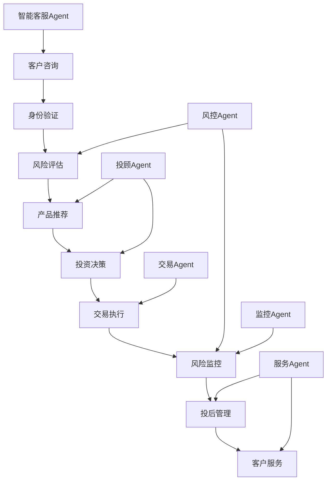
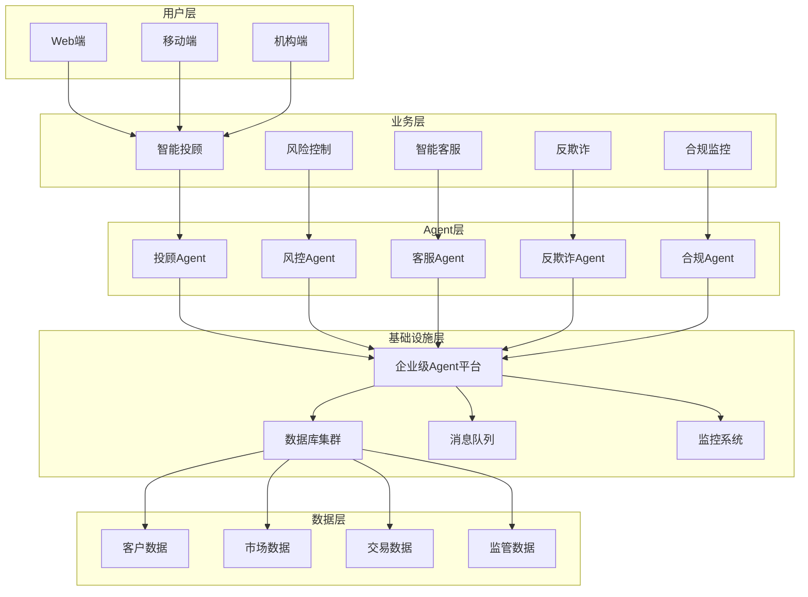

# 项目6：行业解决方案

> **项目背景**：基于前五个项目的技术积累，选择一个具体的垂直行业（金融、医疗、教育、电商），构建完整的AI Agent行业解决方案，包括业务理解、需求分析、系统设计、实施部署和商业化运营。

## 🎯 项目概述

### 项目背景
AI Agent技术要真正产生商业价值，必须深入垂直行业，解决具体的业务问题。本项目将选择一个具体行业，深入理解业务流程、监管要求、用户需求，构建一个完整的行业解决方案，实现从技术到商业的闭环。

### 核心价值
- **业务深度**：深入理解特定行业的业务逻辑和痛点
- **合规保证**：满足行业特有的监管和合规要求
- **用户体验**：提供符合行业用户习惯的产品体验
- **商业闭环**：实现可持续的商业模式和盈利能力
- **生态构建**：建立行业生态系统和合作伙伴网络

### 可选行业方向

#### 行业选择矩阵
| 行业 | 市场规模 | 技术成熟度 | 监管复杂度 | 商业机会 | 推荐指数 |
|------|----------|------------|------------|----------|----------|
| **智能金融** | 万亿级 | 高 | 高 | 高 | ⭐⭐⭐⭐⭐ |
| **智慧医疗** | 千亿级 | 中 | 极高 | 高 | ⭐⭐⭐⭐ |
| **在线教育** | 千亿级 | 高 | 中 | 高 | ⭐⭐⭐⭐⭐ |
| **智能客服** | 百亿级 | 高 | 低 | 中 | ⭐⭐⭐⭐ |
| **智能制造** | 万亿级 | 中 | 中 | 高 | ⭐⭐⭐ |

## 📋 方案一：智能金融解决方案

> **选择理由**：金融行业数字化程度高、数据丰富、对AI技术接受度高、商业价值明确

### 业务场景分析

#### 核心业务场景
| 场景 | 业务价值 | 技术难度 | 实现优先级 |
|------|----------|----------|------------|
| **智能投顾** | 资产管理自动化 | ⭐⭐⭐⭐ | P0 |
| **风险控制** | 降低坏账率 | ⭐⭐⭐⭐⭐ | P0 |
| **智能客服** | 提升服务效率 | ⭐⭐⭐ | P0 |
| **反欺诈检测** | 减少欺诈损失 | ⭐⭐⭐⭐⭐ | P1 |
| **合规监控** | 自动化合规检查 | ⭐⭐⭐⭐ | P1 |
| **量化交易** | 投资收益优化 | ⭐⭐⭐⭐⭐ | P2 |

#### 业务流程分析



### 技术架构设计

#### 系统架构


### 核心Agent实现

#### 1. 智能投顾Agent
```python
# agents/investment_advisor.py
from typing import Dict, Any, List, Optional
from dataclasses import dataclass
from datetime import datetime, timedelta
import numpy as np
import pandas as pd
from langchain_openai import ChatOpenAI
from langchain.prompts import PromptTemplate
from ..base.financial_agent import FinancialAgent
from ..tools.market_data import MarketDataTool
from ..tools.risk_calculator import RiskCalculatorTool
from ..tools.portfolio_optimizer import PortfolioOptimizerTool

@dataclass
class InvestmentProfile:
    """投资者画像"""
    user_id: str
    age: int
    income: float
    risk_tolerance: str  # conservative, moderate, aggressive
    investment_experience: str  # beginner, intermediate, advanced
    investment_goal: str  # retirement, education, wealth_growth
    time_horizon: int  # years
    liquidity_needs: float
    current_portfolio: Dict[str, float]

@dataclass
class MarketInsight:
    """市场洞察"""
    asset_class: str
    outlook: str  # bullish, bearish, neutral
    confidence: float
    reasoning: str
    time_horizon: str
    risk_factors: List[str]

class InvestmentAdvisorAgent(FinancialAgent):
    """智能投顾Agent"""

    def __init__(self):
        super().__init__()
        self.llm = ChatOpenAI(model="gpt-4", temperature=0.3)

        # 工具初始化
        self.market_data = MarketDataTool()
        self.risk_calculator = RiskCalculatorTool()
        self.portfolio_optimizer = PortfolioOptimizerTool()

        # 投资策略模板
        self.strategy_prompt = PromptTemplate(
            input_variables=["profile", "market_data", "current_portfolio"],
            template="""
你是一位专业的投资顾问，具有CFA资格和10年以上投资经验。

客户投资画像：
{profile}

当前市场数据：
{market_data}

客户现有投资组合：
{current_portfolio}

请基于以上信息，提供专业的投资建议：

1. 投资组合分析
   - 现有组合的优缺点
   - 风险收益特征
   - 与客户目标的匹配度

2. 市场分析
   - 当前市场环境评估
   - 主要机会和风险
   - 适合的投资策略

3. 具体投资建议
   - 资产配置建议
   - 具体投资标的推荐
   - 投资时机和方式

4. 风险管理
   - 主要风险因素
   - 风险控制措施
   - 止损和止盈策略

请确保建议符合客户的风险承受能力和投资目标。
"""
        )

    async def analyze_client_profile(self, user_data: Dict[str, Any]) -> InvestmentProfile:
        """分析客户投资画像"""

        # 风险承受能力评估
        risk_score = 0

        # 年龄因素
        age = user_data.get('age', 30)
        if age < 30:
            risk_score += 3
        elif age < 50:
            risk_score += 2
        else:
            risk_score += 1

        # 收入因素
        income = user_data.get('annual_income', 0)
        if income > 1000000:
            risk_score += 3
        elif income > 500000:
            risk_score += 2
        else:
            risk_score += 1

        # 投资经验
        experience = user_data.get('investment_experience', 'beginner')
        if experience == 'advanced':
            risk_score += 3
        elif experience == 'intermediate':
            risk_score += 2
        else:
            risk_score += 1

        # 确定风险承受能力
        if risk_score >= 7:
            risk_tolerance = 'aggressive'
        elif risk_score >= 5:
            risk_tolerance = 'moderate'
        else:
            risk_tolerance = 'conservative'

        return InvestmentProfile(
            user_id=user_data['user_id'],
            age=age,
            income=income,
            risk_tolerance=risk_tolerance,
            investment_experience=experience,
            investment_goal=user_data.get('investment_goal', 'wealth_growth'),
            time_horizon=user_data.get('time_horizon', 10),
            liquidity_needs=user_data.get('liquidity_needs', 0.1),
            current_portfolio=user_data.get('current_portfolio', {})
        )

    async def get_market_insights(self) -> List[MarketInsight]:
        """获取市场洞察"""

        insights = []

        # 获取市场数据
        market_data = await self.market_data.get_latest_data()

        # 分析主要资产类别
        asset_classes = ['stocks', 'bonds', 'commodities', 'real_estate', 'crypto']

        for asset_class in asset_classes:
            # 技术分析
            technical_signals = await self._analyze_technical_indicators(asset_class, market_data)

            # 基本面分析
            fundamental_signals = await self._analyze_fundamentals(asset_class, market_data)

            # 综合分析
            outlook, confidence, reasoning = await self._synthesize_analysis(
                asset_class, technical_signals, fundamental_signals
            )

            insights.append(MarketInsight(
                asset_class=asset_class,
                outlook=outlook,
                confidence=confidence,
                reasoning=reasoning,
                time_horizon="3-6 months",
                risk_factors=await self._identify_risk_factors(asset_class, market_data)
            ))

        return insights

    async def generate_investment_advice(
        self,
        profile: InvestmentProfile,
        market_insights: List[MarketInsight]
    ) -> Dict[str, Any]:
        """生成投资建议"""

        try:
            # 准备输入数据
            profile_text = f"""
            年龄：{profile.age}岁
            收入：{profile.income:,.0f}元
            风险偏好：{profile.risk_tolerance}
            投资经验：{profile.investment_experience}
            投资目标：{profile.investment_goal}
            投资期限：{profile.time_horizon}年
            流动性需求：{profile.liquidity_needs*100:.1f}%
            """

            market_text = "\n".join([
                f"{insight.asset_class}: {insight.outlook} "
                f"(置信度: {insight.confidence:.1%}) - {insight.reasoning}"
                for insight in market_insights
            ])

            portfolio_text = str(profile.current_portfolio) if profile.current_portfolio else "无现有投资"

            # 生成投资建议
            prompt = self.strategy_prompt.format(
                profile=profile_text,
                market_data=market_text,
                current_portfolio=portfolio_text
            )

            response = await self.llm.ainvoke(prompt)
            advice_text = response.content

            # 生成具体的资产配置
            asset_allocation = await self._generate_asset_allocation(profile, market_insights)

            # 推荐具体投资标的
            recommended_products = await self._recommend_products(profile, asset_allocation)

            # 风险评估
            risk_assessment = await self._assess_portfolio_risk(asset_allocation, market_insights)

            return {
                "success": True,
                "advice": advice_text,
                "asset_allocation": asset_allocation,
                "recommended_products": recommended_products,
                "risk_assessment": risk_assessment,
                "market_insights": [
                    {
                        "asset_class": insight.asset_class,
                        "outlook": insight.outlook,
                        "confidence": insight.confidence,
                        "reasoning": insight.reasoning
                    }
                    for insight in market_insights
                ],
                "timestamp": datetime.now().isoformat()
            }

        except Exception as e:
            return {
                "success": False,
                "error": str(e),
                "timestamp": datetime.now().isoformat()
            }

    async def _generate_asset_allocation(
        self,
        profile: InvestmentProfile,
        market_insights: List[MarketInsight]
    ) -> Dict[str, float]:
        """生成资产配置建议"""

        # 基础配置模板
        base_allocations = {
            'conservative': {'stocks': 0.3, 'bonds': 0.6, 'cash': 0.1},
            'moderate': {'stocks': 0.6, 'bonds': 0.3, 'alternatives': 0.05, 'cash': 0.05},
            'aggressive': {'stocks': 0.8, 'bonds': 0.1, 'alternatives': 0.08, 'cash': 0.02}
        }

        base_allocation = base_allocations[profile.risk_tolerance].copy()

        # 根据市场洞察调整
        for insight in market_insights:
            if insight.asset_class in base_allocation:
                if insight.outlook == 'bullish' and insight.confidence > 0.7:
                    # 增加看好资产的配置
                    base_allocation[insight.asset_class] *= 1.2
                elif insight.outlook == 'bearish' and insight.confidence > 0.7:
                    # 减少看空资产的配置
                    base_allocation[insight.asset_class] *= 0.8

        # 归一化到100%
        total = sum(base_allocation.values())
        normalized_allocation = {k: v/total for k, v in base_allocation.items()}

        return normalized_allocation

    async def _recommend_products(
        self,
        profile: InvestmentProfile,
        asset_allocation: Dict[str, float]
    ) -> List[Dict[str, Any]]:
        """推荐具体投资产品"""

        products = []

        for asset_class, weight in asset_allocation.items():
            if weight > 0.01:  # 只推荐权重超过1%的资产
                if asset_class == 'stocks':
                    if profile.risk_tolerance == 'conservative':
                        products.extend([
                            {"name": "沪深300ETF", "code": "510300", "type": "ETF", "weight": weight * 0.6},
                            {"name": "红利ETF", "code": "510880", "type": "ETF", "weight": weight * 0.4}
                        ])
                    elif profile.risk_tolerance == 'moderate':
                        products.extend([
                            {"name": "沪深300ETF", "code": "510300", "type": "ETF", "weight": weight * 0.4},
                            {"name": "中证500ETF", "code": "510500", "type": "ETF", "weight": weight * 0.3},
                            {"name": "创业板ETF", "code": "159915", "type": "ETF", "weight": weight * 0.3}
                        ])
                    else:  # aggressive
                        products.extend([
                            {"name": "纳斯达克100ETF", "code": "513100", "type": "ETF", "weight": weight * 0.4},
                            {"name": "科技ETF", "code": "515000", "type": "ETF", "weight": weight * 0.6}
                        ])

                elif asset_class == 'bonds':
                    products.extend([
                        {"name": "国债ETF", "code": "511010", "type": "ETF", "weight": weight * 0.7},
                        {"name": "企业债ETF", "code": "511220", "type": "ETF", "weight": weight * 0.3}
                    ])

                elif asset_class == 'alternatives':
                    products.extend([
                        {"name": "黄金ETF", "code": "518880", "type": "ETF", "weight": weight * 0.5},
                        {"name": "REITs基金", "code": "508000", "type": "基金", "weight": weight * 0.5}
                    ])

        return products

    async def _assess_portfolio_risk(
        self,
        asset_allocation: Dict[str, float],
        market_insights: List[MarketInsight]
    ) -> Dict[str, Any]:
        """评估投资组合风险"""

        # 计算预期收益和风险
        expected_returns = {
            'stocks': 0.08,
            'bonds': 0.04,
            'alternatives': 0.06,
            'cash': 0.02
        }

        volatilities = {
            'stocks': 0.20,
            'bonds': 0.05,
            'alternatives': 0.15,
            'cash': 0.01
        }

        # 投资组合预期收益
        portfolio_return = sum(
            weight * expected_returns.get(asset, 0)
            for asset, weight in asset_allocation.items()
        )

        # 投资组合风险（简化计算，假设相关性为0.3）
        portfolio_risk = np.sqrt(sum(
            (weight * volatilities.get(asset, 0)) ** 2
            for asset, weight in asset_allocation.items()
        ))

        # 风险评级
        if portfolio_risk < 0.1:
            risk_level = "低风险"
        elif portfolio_risk < 0.15:
            risk_level = "中等风险"
        else:
            risk_level = "高风险"

        # 最大回撤估算
        max_drawdown = portfolio_risk * 2.5  # 简化估算

        return {
            "expected_annual_return": f"{portfolio_return:.2%}",
            "annual_volatility": f"{portfolio_risk:.2%}",
            "risk_level": risk_level,
            "estimated_max_drawdown": f"{max_drawdown:.2%}",
            "sharpe_ratio": (portfolio_return - 0.02) / portfolio_risk,  # 假设无风险利率2%
            "risk_factors": [
                "市场系统性风险",
                "流动性风险",
                "通胀风险"
            ]
        }

    async def monitor_portfolio_performance(
        self,
        user_id: str,
        portfolio: Dict[str, float],
        benchmark: str = "沪深300"
    ) -> Dict[str, Any]:
        """监控投资组合表现"""

        try:
            # 获取投资组合历史数据
            portfolio_data = await self.market_data.get_portfolio_data(portfolio)
            benchmark_data = await self.market_data.get_benchmark_data(benchmark)

            # 计算收益率
            portfolio_returns = await self._calculate_returns(portfolio_data)
            benchmark_returns = await self._calculate_returns(benchmark_data)

            # 风险指标
            risk_metrics = await self._calculate_risk_metrics(portfolio_returns, benchmark_returns)

            # 归因分析
            attribution = await self._perform_attribution_analysis(portfolio, portfolio_returns)

            # 调仓建议
            rebalancing_advice = await self._generate_rebalancing_advice(
                user_id, portfolio, risk_metrics
            )

            return {
                "performance_summary": {
                    "total_return": risk_metrics["total_return"],
                    "annual_return": risk_metrics["annual_return"],
                    "volatility": risk_metrics["volatility"],
                    "sharpe_ratio": risk_metrics["sharpe_ratio"],
                    "max_drawdown": risk_metrics["max_drawdown"]
                },
                "benchmark_comparison": {
                    "excess_return": risk_metrics["excess_return"],
                    "tracking_error": risk_metrics["tracking_error"],
                    "information_ratio": risk_metrics["information_ratio"]
                },
                "attribution_analysis": attribution,
                "rebalancing_advice": rebalancing_advice,
                "timestamp": datetime.now().isoformat()
            }

        except Exception as e:
            return {
                "success": False,
                "error": str(e),
                "timestamp": datetime.now().isoformat()
            }
```

#### 2. 风控Agent
```python
# agents/risk_control.py
from typing import Dict, Any, List, Optional
from dataclasses import dataclass
from datetime import datetime, timedelta
import numpy as np
from enum import Enum
from langchain_openai import ChatOpenAI
from ..base.financial_agent import FinancialAgent
from ..tools.risk_models import RiskModelTool
from ..tools.stress_testing import StressTestingTool

class RiskLevel(Enum):
    LOW = "低风险"
    MEDIUM = "中等风险"
    HIGH = "高风险"
    CRITICAL = "严重风险"

@dataclass
class RiskAlert:
    """风险预警"""
    alert_id: str
    user_id: str
    risk_type: str
    risk_level: RiskLevel
    description: str
    recommended_actions: List[str]
    created_at: datetime
    expires_at: Optional[datetime] = None

class RiskControlAgent(FinancialAgent):
    """风险控制Agent"""

    def __init__(self):
        super().__init__()
        self.llm = ChatOpenAI(model="gpt-4", temperature=0.1)
        self.risk_model = RiskModelTool()
        self.stress_testing = StressTestingTool()

        # 风险阈值配置
        self.risk_thresholds = {
            'var_95': 0.05,  # 95% VaR不超过5%
            'max_drawdown': 0.20,  # 最大回撤不超过20%
            'concentration': 0.30,  # 单一资产不超过30%
            'leverage': 2.0,  # 杠杆不超过2倍
            'liquidity': 0.10  # 流动性缓冲不低于10%
        }

    async def assess_portfolio_risk(
        self,
        user_id: str,
        portfolio: Dict[str, float],
        user_profile: Dict[str, Any]
    ) -> Dict[str, Any]:
        """评估投资组合风险"""

        try:
            # 1. 计算VaR和CVaR
            var_metrics = await self._calculate_var_metrics(portfolio)

            # 2. 压力测试
            stress_results = await self._perform_stress_tests(portfolio)

            # 3. 集中度风险检查
            concentration_risk = await self._check_concentration_risk(portfolio)

            # 4. 流动性风险评估
            liquidity_risk = await self._assess_liquidity_risk(portfolio)

            # 5. 市场风险分解
            market_risk = await self._decompose_market_risk(portfolio)

            # 6. 信用风险评估
            credit_risk = await self._assess_credit_risk(portfolio)

            # 7. 生成风险评级
            overall_risk = await self._calculate_overall_risk(
                var_metrics, stress_results, concentration_risk,
                liquidity_risk, market_risk, credit_risk
            )

            # 8. 风险建议
            risk_recommendations = await self._generate_risk_recommendations(
                user_profile, overall_risk, portfolio
            )

            return {
                "risk_assessment": {
                    "overall_risk_level": overall_risk["level"],
                    "risk_score": overall_risk["score"],
                    "var_95": var_metrics["var_95"],
                    "cvar_95": var_metrics["cvar_95"],
                    "max_drawdown": var_metrics["max_drawdown"]
                },
                "stress_testing": stress_results,
                "risk_breakdown": {
                    "market_risk": market_risk,
                    "credit_risk": credit_risk,
                    "concentration_risk": concentration_risk,
                    "liquidity_risk": liquidity_risk
                },
                "recommendations": risk_recommendations,
                "alerts": await self._generate_risk_alerts(user_id, overall_risk, portfolio),
                "timestamp": datetime.now().isoformat()
            }

        except Exception as e:
            return {
                "success": False,
                "error": str(e),
                "timestamp": datetime.now().isoformat()
            }

    async def monitor_real_time_risk(
        self,
        user_id: str,
        portfolio: Dict[str, float]
    ) -> List[RiskAlert]:
        """实时风险监控"""

        alerts = []

        try:
            # 获取实时市场数据
            market_data = await self.risk_model.get_real_time_data()

            # 检查各类风险指标
            risk_checks = [
                self._check_var_breach(portfolio, market_data),
                self._check_concentration_breach(portfolio),
                self._check_correlation_spike(portfolio, market_data),
                self._check_volatility_spike(portfolio, market_data),
                self._check_liquidity_stress(portfolio, market_data)
            ]

            # 执行所有风险检查
            for check in risk_checks:
                alert = await check
                if alert:
                    alerts.append(alert)

            # 记录风险监控日志
            await self._log_risk_monitoring(user_id, portfolio, alerts)

        except Exception as e:
            # 创建系统错误警报
            error_alert = RiskAlert(
                alert_id=f"sys_error_{datetime.now().timestamp()}",
                user_id=user_id,
                risk_type="系统错误",
                risk_level=RiskLevel.HIGH,
                description=f"风险监控系统出现错误: {str(e)}",
                recommended_actions=["联系技术支持", "手动检查投资组合"],
                created_at=datetime.now()
            )
            alerts.append(error_alert)

        return alerts

    async def _calculate_var_metrics(self, portfolio: Dict[str, float]) -> Dict[str, float]:
        """计算VaR指标"""

        # 获取历史数据
        historical_data = await self.risk_model.get_historical_returns(portfolio)

        # 计算投资组合收益率
        portfolio_returns = np.array(historical_data['portfolio_returns'])

        # 95% VaR
        var_95 = np.percentile(portfolio_returns, 5)

        # 95% CVaR (条件VaR)
        cvar_95 = portfolio_returns[portfolio_returns <= var_95].mean()

        # 最大回撤
        cumulative_returns = (1 + portfolio_returns).cumprod()
        peak = np.maximum.accumulate(cumulative_returns)
        drawdown = (cumulative_returns - peak) / peak
        max_drawdown = drawdown.min()

        return {
            "var_95": abs(var_95),
            "cvar_95": abs(cvar_95),
            "max_drawdown": abs(max_drawdown)
        }

    async def _perform_stress_tests(self, portfolio: Dict[str, float]) -> Dict[str, Any]:
        """执行压力测试"""

        stress_scenarios = {
            "market_crash": {"stocks": -0.30, "bonds": -0.10, "alternatives": -0.20},
            "interest_rate_shock": {"stocks": -0.05, "bonds": -0.15, "alternatives": -0.03},
            "inflation_surge": {"stocks": -0.10, "bonds": -0.20, "alternatives": 0.10},
            "geopolitical_crisis": {"stocks": -0.25, "bonds": 0.05, "alternatives": -0.15},
            "liquidity_crisis": {"stocks": -0.35, "bonds": -0.05, "alternatives": -0.30}
        }

        stress_results = {}

        for scenario_name, shocks in stress_scenarios.items():
            # 计算场景下的投资组合损失
            portfolio_loss = 0
            for asset, weight in portfolio.items():
                shock = shocks.get(asset, 0)
                portfolio_loss += weight * shock

            stress_results[scenario_name] = {
                "portfolio_loss": portfolio_loss,
                "loss_percentage": f"{portfolio_loss:.2%}",
                "risk_level": self._categorize_stress_loss(portfolio_loss)
            }

        return stress_results

    def _categorize_stress_loss(self, loss: float) -> str:
        """分类压力测试损失"""
        if abs(loss) < 0.05:
            return "低风险"
        elif abs(loss) < 0.15:
            return "中等风险"
        elif abs(loss) < 0.25:
            return "高风险"
        else:
            return "严重风险"

    async def _check_concentration_risk(self, portfolio: Dict[str, float]) -> Dict[str, Any]:
        """检查集中度风险"""

        # 按资产类别汇总
        asset_class_exposure = {}
        for asset, weight in portfolio.items():
            asset_class = await self._get_asset_class(asset)
            asset_class_exposure[asset_class] = asset_class_exposure.get(asset_class, 0) + weight

        # 检查单一资产集中度
        max_single_asset = max(portfolio.values()) if portfolio else 0
        max_asset_class = max(asset_class_exposure.values()) if asset_class_exposure else 0

        # 计算赫芬达尔指数（HHI）
        hhi = sum(weight ** 2 for weight in portfolio.values())

        concentration_risk = {
            "max_single_asset": max_single_asset,
            "max_asset_class": max_asset_class,
            "hhi_index": hhi,
            "diversification_score": 1 - hhi,
            "risk_level": self._categorize_concentration_risk(max_single_asset, hhi)
        }

        return concentration_risk

    async def generate_risk_report(
        self,
        user_id: str,
        period: str = "monthly"
    ) -> Dict[str, Any]:
        """生成风险报告"""

        try:
            # 获取用户投资组合历史
            portfolio_history = await self._get_portfolio_history(user_id, period)

            # 风险指标趋势分析
            risk_trends = await self._analyze_risk_trends(portfolio_history)

            # 风险事件回顾
            risk_events = await self._review_risk_events(user_id, period)

            # 风险管理效果评估
            risk_management_effectiveness = await self._evaluate_risk_management(user_id, period)

            # 改进建议
            improvement_suggestions = await self._generate_improvement_suggestions(
                risk_trends, risk_events, risk_management_effectiveness
            )

            # 生成报告文本
            report_text = await self._generate_report_narrative(
                user_id, period, risk_trends, risk_events, improvement_suggestions
            )

            return {
                "report": {
                    "period": period,
                    "user_id": user_id,
                    "generated_at": datetime.now().isoformat(),
                    "executive_summary": report_text,
                    "risk_trends": risk_trends,
                    "risk_events": risk_events,
                    "management_effectiveness": risk_management_effectiveness,
                    "improvement_suggestions": improvement_suggestions
                }
            }

        except Exception as e:
            return {
                "success": False,
                "error": str(e),
                "timestamp": datetime.now().isoformat()
            }
```

### 合规和安全

#### 金融监管合规
```python
# compliance/financial_regulations.py
from typing import Dict, Any, List, Optional
from dataclasses import dataclass
from datetime import datetime
from enum import Enum

class RegulationLevel(Enum):
    CRITICAL = "严重违规"
    HIGH = "高风险"
    MEDIUM = "中等风险"
    LOW = "低风险"
    COMPLIANT = "合规"

@dataclass
class ComplianceCheck:
    """合规检查结果"""
    check_id: str
    regulation_name: str
    status: RegulationLevel
    description: str
    violations: List[str]
    recommendations: List[str]
    deadline: Optional[datetime] = None

class FinancialComplianceAgent:
    """金融合规Agent"""

    def __init__(self):
        # 监管规则配置
        self.regulation_rules = {
            "适当性管理": {
                "description": "投资者适当性管理规定",
                "checks": [
                    "risk_tolerance_match",
                    "investment_experience_check",
                    "financial_status_verification"
                ]
            },
            "反洗钱": {
                "description": "反洗钱法律法规",
                "checks": [
                    "kyc_verification",
                    "transaction_monitoring",
                    "suspicious_activity_detection"
                ]
            },
            "信息披露": {
                "description": "信息披露管理办法",
                "checks": [
                    "risk_disclosure",
                    "fee_disclosure",
                    "performance_disclosure"
                ]
            },
            "数据保护": {
                "description": "个人信息保护法",
                "checks": [
                    "data_encryption",
                    "consent_management",
                    "data_retention_policy"
                ]
            }
        }

    async def perform_compliance_check(
        self,
        user_id: str,
        transaction_data: Dict[str, Any],
        user_profile: Dict[str, Any]
    ) -> List[ComplianceCheck]:
        """执行合规检查"""

        compliance_results = []

        # 1. 适当性管理检查
        suitability_check = await self._check_investment_suitability(
            user_profile, transaction_data
        )
        compliance_results.append(suitability_check)

        # 2. 反洗钱检查
        aml_check = await self._check_anti_money_laundering(
            user_id, transaction_data
        )
        compliance_results.append(aml_check)

        # 3. 信息披露检查
        disclosure_check = await self._check_information_disclosure(
            transaction_data
        )
        compliance_results.append(disclosure_check)

        # 4. 数据保护检查
        privacy_check = await self._check_data_protection(
            user_id, user_profile
        )
        compliance_results.append(privacy_check)

        return compliance_results

    async def _check_investment_suitability(
        self,
        user_profile: Dict[str, Any],
        transaction_data: Dict[str, Any]
    ) -> ComplianceCheck:
        """检查投资适当性"""

        violations = []
        recommendations = []

        # 风险承受能力匹配
        user_risk_level = user_profile.get('risk_tolerance', 'conservative')
        product_risk_level = transaction_data.get('product_risk_level', 'medium')

        risk_mapping = {
            'conservative': ['low'],
            'moderate': ['low', 'medium'],
            'aggressive': ['low', 'medium', 'high']
        }

        if product_risk_level not in risk_mapping.get(user_risk_level, []):
            violations.append(f"产品风险等级({product_risk_level})与客户风险承受能力({user_risk_level})不匹配")
            recommendations.append("建议选择风险等级更低的产品或重新评估客户风险承受能力")

        # 投资经验检查
        investment_experience = user_profile.get('investment_experience', 'beginner')
        product_complexity = transaction_data.get('product_complexity', 'simple')

        if investment_experience == 'beginner' and product_complexity == 'complex':
            violations.append("复杂产品不适合投资经验不足的客户")
            recommendations.append("建议客户先投资简单产品，积累经验后再考虑复杂产品")

        # 确定合规状态
        if violations:
            status = RegulationLevel.HIGH if len(violations) > 1 else RegulationLevel.MEDIUM
        else:
            status = RegulationLevel.COMPLIANT

        return ComplianceCheck(
            check_id=f"suitability_{datetime.now().timestamp()}",
            regulation_name="适当性管理",
            status=status,
            description="投资者适当性管理规定合规检查",
            violations=violations,
            recommendations=recommendations
        )
```

## 📊 项目评估和商业模式

### 商业模式设计

#### 收入模式
| 收入来源 | 定价模式 | 预期占比 | 说明 |
|----------|----------|----------|------|
| **管理费** | 按资产规模收费(0.5-1.5%) | 60% | 主要收入来源 |
| **业绩提成** | 超额收益分成(10-20%) | 25% | 激励对齐 |
| **技术服务费** | 订阅制(月费/年费) | 10% | SaaS模式 |
| **数据服务** | 按调用量收费 | 3% | API服务 |
| **培训咨询** | 项目制收费 | 2% | 增值服务 |

#### 成本结构
| 成本类别 | 占比 | 主要构成 |
|----------|------|----------|
| **技术成本** | 35% | AI模型调用、云服务、开发 |
| **人员成本** | 30% | 技术团队、业务团队 |
| **合规成本** | 15% | 牌照、审计、法务 |
| **营销成本** | 12% | 获客、品牌建设 |
| **运营成本** | 8% | 办公、管理费用 |

### 实施路线图

#### 第一阶段：MVP开发（3个月）
- [ ] 核心Agent开发（投顾、风控、客服）
- [ ] 基础平台搭建
- [ ] 合规框架建设
- [ ] 内测版本发布

#### 第二阶段：Beta测试（2个月）
- [ ] 邀请种子用户测试
- [ ] 收集用户反馈
- [ ] 功能优化和bug修复
- [ ] 监管报备和许可申请

#### 第三阶段：正式上线（1个月）
- [ ] 公开发布
- [ ] 营销推广
- [ ] 用户增长
- [ ] 运营监控

#### 第四阶段：规模扩展（6个月）
- [ ] 功能扩展
- [ ] 市场推广
- [ ] 合作伙伴拓展
- [ ] 国际化准备

### 风险评估和应对

#### 主要风险
| 风险类别 | 风险等级 | 应对措施 |
|----------|----------|----------|
| **监管风险** | 高 | 合规先行、持续跟踪政策 |
| **技术风险** | 中 | 多重备份、灾备方案 |
| **市场风险** | 中 | 差异化定位、多元化策略 |
| **竞争风险** | 高 | 技术壁垒、生态建设 |
| **资金风险** | 中 | 分阶段融资、现金流控制 |

---

**项目完成标志**：成功发布金融行业AI Agent解决方案，获得用户认可和监管许可，实现商业化运营，成为具有行业影响力的AI Agent产品。

*预计完成时间：4周 | 难度等级：⭐⭐⭐⭐⭐ | 前置要求：完成前五个项目，具备深度行业理解*