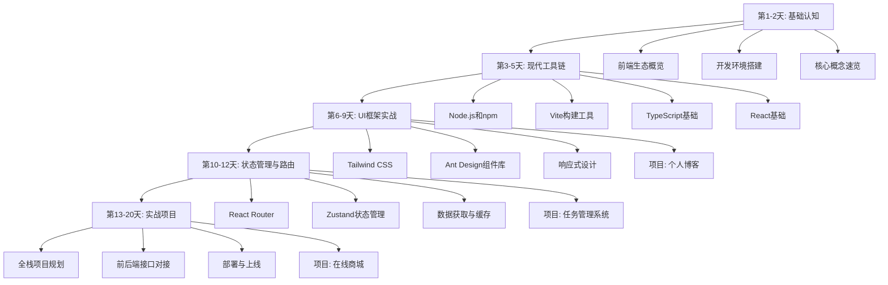

# 前端学习路线图

## 🎯 总体规划（15-20天完成）



## 📅 详细学习计划

### 第1-2天：基础认知
**目标**: 建立前端开发的整体认知

#### Day 1: 前端生态和环境搭建
- [ ] 阅读 [前端生态概览](./01-basics/frontend-ecosystem.md)
- [ ] 完成 [开发环境搭建](./01-basics/dev-environment.md)
- [ ] 创建第一个React项目
- [ ] 熟悉VS Code和开发者工具

**实践任务**:
```bash
# 创建并运行第一个项目
npm create vite@latest my-first-app -- --template react-ts
cd my-first-app
npm install
npm run dev
```

#### Day 2: 核心概念理解
- [ ] 学习 [核心概念速览](./01-basics/core-concepts.md)
- [ ] 理解HTML/CSS/JavaScript基础
- [ ] 掌握React组件概念
- [ ] 练习JSX语法

**实践任务**:
- 修改默认的React应用
- 创建自己的第一个组件
- 添加简单的交互功能

### 第3-5天：现代工具链
**目标**: 掌握现代前端开发工具

#### Day 3: Node.js和包管理
- [ ] 学习 [Node.js和npm](./02-toolchain/nodejs-npm.md)
- [ ] 理解package.json配置
- [ ] 掌握npm命令使用
- [ ] 学会依赖管理

**实践任务**:
- 安装和管理项目依赖
- 编写npm脚本
- 解决依赖冲突问题

#### Day 4: Vite构建工具
- [ ] 学习Vite配置和使用
- [ ] 理解模块热替换(HMR)
- [ ] 掌握构建和部署流程

#### Day 5: TypeScript基础
- [ ] 学习TypeScript基本语法
- [ ] 理解类型系统
- [ ] 在React中使用TypeScript

**实践任务**:
- 将JavaScript项目迁移到TypeScript
- 定义组件的Props类型
- 使用接口定义数据结构

### 第6-9天：UI框架实战
**目标**: 快速构建美观的用户界面

#### Day 6: Tailwind CSS
- [ ] 学习Tailwind CSS工具类
- [ ] 掌握响应式设计
- [ ] 理解设计系统概念

**实践任务**:
```bash
# 安装Tailwind CSS
npm install -D tailwindcss postcss autoprefixer
npx tailwindcss init -p
```

#### Day 7: Ant Design组件库
- [ ] 学习Ant Design组件使用
- [ ] 掌握表单处理
- [ ] 理解主题定制

**实践任务**:
- 使用Ant Design重构界面
- 创建表单和数据表格
- 实现基本的CRUD操作

#### Day 8-9: 项目实战 - 个人博客系统
**实践项目**: 构建一个完整的个人博客系统

功能要求:
- [ ] 文章列表展示
- [ ] 文章详情页面
- [ ] 分类和标签
- [ ] 搜索功能
- [ ] 响应式设计

### 第10-12天：状态管理与路由
**目标**: 构建复杂的单页应用

#### Day 10: React Router
- [ ] 学习路由配置
- [ ] 掌握动态路由
- [ ] 理解路由守卫

#### Day 11: Zustand状态管理
- [ ] 学习全局状态管理
- [ ] 掌握状态更新模式
- [ ] 理解状态持久化

#### Day 12: 数据获取与缓存
- [ ] 学习Axios使用
- [ ] 掌握异步数据处理
- [ ] 理解错误处理

**实践项目**: 任务管理系统
- [ ] 用户认证
- [ ] 任务CRUD操作
- [ ] 状态筛选
- [ ] 数据持久化

### 第13-20天：实战项目
**目标**: 开发完整的全栈应用

#### Day 13-15: 项目规划和基础搭建
- [ ] 需求分析和技术选型
- [ ] 项目架构设计
- [ ] 基础框架搭建
- [ ] API接口设计

#### Day 16-18: 核心功能开发
- [ ] 用户系统
- [ ] 商品管理
- [ ] 购物车功能
- [ ] 订单处理

#### Day 19-20: 优化和部署
- [ ] 性能优化
- [ ] 错误处理
- [ ] 测试和调试
- [ ] 部署上线

## 🎯 学习检查点

### 第一阶段检查点（Day 2）
- [ ] 能够创建和运行React项目
- [ ] 理解组件化开发概念
- [ ] 掌握基本的JSX语法
- [ ] 能够使用开发者工具调试

### 第二阶段检查点（Day 5）
- [ ] 熟练使用npm管理依赖
- [ ] 理解TypeScript类型系统
- [ ] 能够配置开发环境
- [ ] 掌握现代构建工具

### 第三阶段检查点（Day 9）
- [ ] 能够快速构建美观界面
- [ ] 掌握响应式设计
- [ ] 熟练使用组件库
- [ ] 完成第一个完整项目

### 第四阶段检查点（Day 12）
- [ ] 理解单页应用架构
- [ ] 掌握状态管理模式
- [ ] 能够处理复杂的用户交互
- [ ] 熟练进行前后端数据交互

### 最终检查点（Day 20）
- [ ] 能够独立开发完整的Web应用
- [ ] 掌握前端开发最佳实践
- [ ] 理解性能优化原理
- [ ] 具备解决实际问题的能力

## 📚 学习资源

### 官方文档
- [React官方文档](https://react.dev/)
- [TypeScript官方文档](https://www.typescriptlang.org/)
- [Vite官方文档](https://vitejs.dev/)
- [Tailwind CSS文档](https://tailwindcss.com/)

### 实用工具
- [Can I Use](https://caniuse.com/) - 浏览器兼容性查询
- [MDN Web Docs](https://developer.mozilla.org/) - Web技术文档
- [React DevTools](https://react.dev/learn/react-developer-tools) - React调试工具

### 代码示例
- [React官方示例](https://react.dev/learn)
- [TypeScript Playground](https://www.typescriptlang.org/play)
- [Tailwind CSS示例](https://tailwindui.com/components)

## 🎯 学习建议

### 1. 学习方法
- **实践导向**: 每个概念都要通过代码实践
- **项目驱动**: 通过实际项目巩固知识
- **循序渐进**: 不要跳跃式学习
- **及时总结**: 每天记录学习心得

### 2. 时间安排
- **每天2-3小时**: 保证学习连续性
- **理论1小时**: 阅读文档和教程
- **实践2小时**: 编写代码和项目
- **周末复习**: 回顾和总结本周内容

### 3. 遇到问题时
1. 先查看官方文档
2. 搜索Stack Overflow
3. 查看GitHub Issues
4. 询问社区或同事

### 4. 学习重点
- **重点掌握**: React、TypeScript、状态管理
- **了解即可**: CSS动画、浏览器兼容性
- **暂时跳过**: 复杂的构建配置、高级优化

## 🚀 进阶方向

完成基础学习后，可以选择以下方向深入：

### 1. 技术深度
- React高级特性（Suspense、Concurrent Mode）
- 性能优化（代码分割、懒加载）
- 测试（Jest、React Testing Library）
- 微前端架构

### 2. 技术广度
- Vue.js或Angular
- React Native移动开发
- Next.js全栈框架
- GraphQL数据查询

### 3. 工程化
- CI/CD流程
- 代码质量管理
- 监控和错误追踪
- 团队协作规范

---

**开始你的前端学习之旅吧！记住：最好的学习方法就是动手实践。**